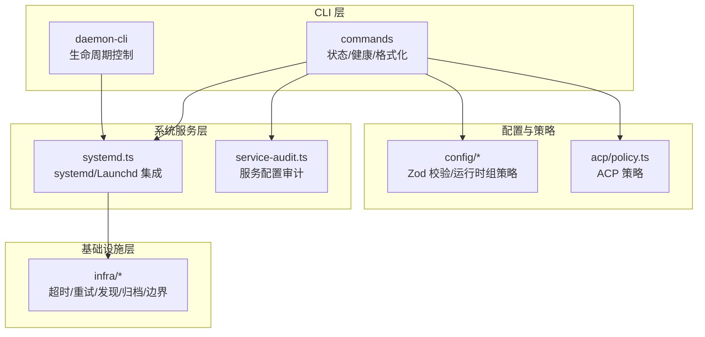
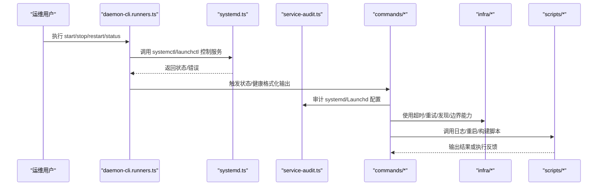
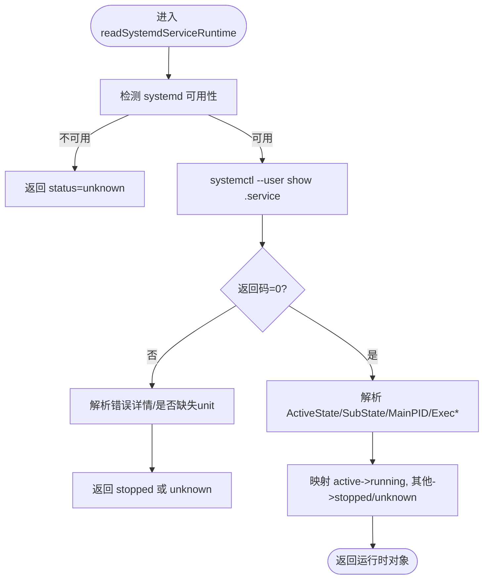
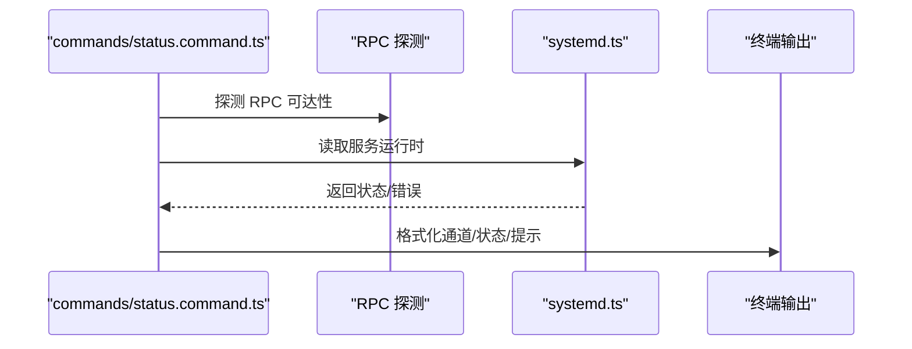
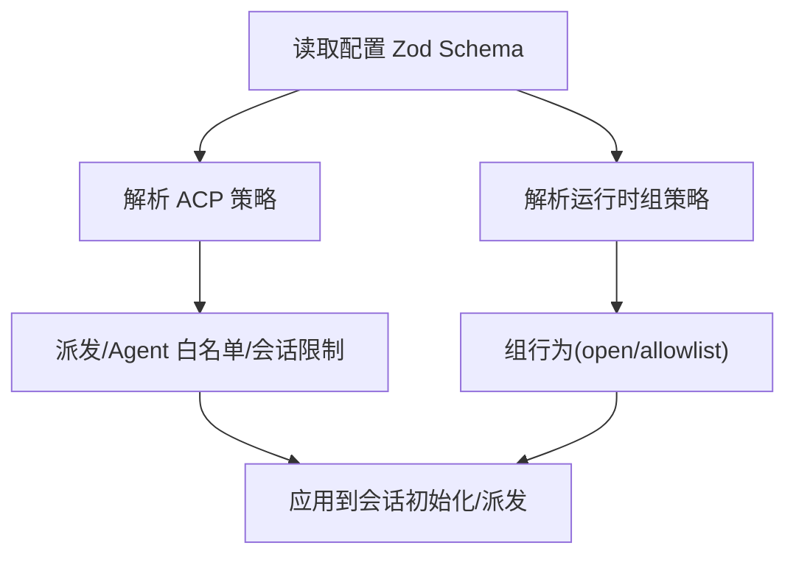
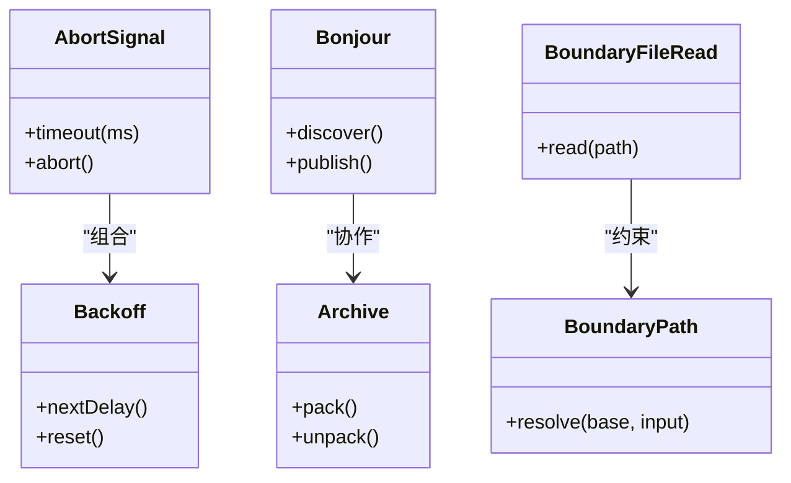
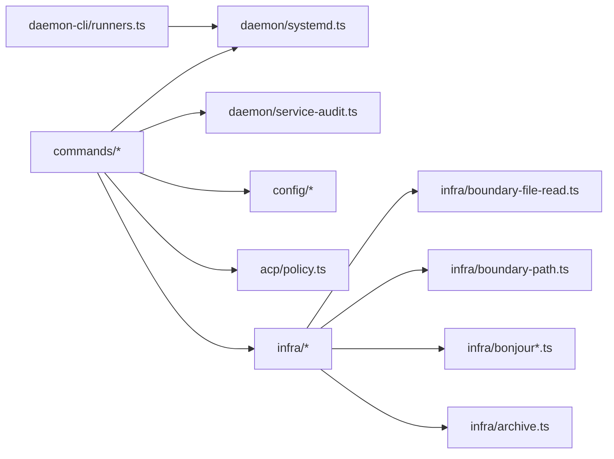

# 基础设施设计

<cite>
**本文引用的文件**
- [src/daemon/systemd.ts](file://src/daemon/systemd.ts)
- [src/cli/daemon-cli/runners.ts](file://src/cli/daemon-cli/runners.ts)
- [src/cli/daemon-cli/status.print.ts](file://src/cli/daemon-cli/status.print.ts)
- [src/commands/status.daemon.ts](file://src/commands/status.daemon.ts)
- [src/commands/status.format.ts](file://src/commands/status.format.ts)
- [src/commands/health-format.ts](file://src/commands/health-format.ts)
- [src/daemon/service-audit.ts](file://src/daemon/service-audit.ts)
- [src/commands/status.command.ts](file://src/commands/status.command.ts)
- [src/commands/node-daemon-runtime.ts](file://src/commands/node-daemon-runtime.ts)
- [src/config/zod-schema.ts](file://src/config/zod-schema.ts)
- [src/config/runtime-group-policy-provider.ts](file://src/config/runtime-group-policy-provider.ts)
- [src/acp/policy.ts](file://src/acp/policy.ts)
- [src/shared/operator-scope-compat.ts](file://src/shared/operator-scope-compat.ts)
- [src/infra/abort-signal.ts](file://src/infra/abort-signal.ts)
- [src/infra/backoff.ts](file://src/infra/backoff.ts)
- [src/infra/bonjour.ts](file://src/infra/bonjour.ts)
- [src/infra/bonjour-discovery.ts](file://src/infra/bonjour-discovery.ts)
- [src/infra/archive.ts](file://src/infra/archive.ts)
- [src/infra/boundary-file-read.ts](file://src/infra/boundary-file-read.ts)
- [src/infra/boundary-path.ts](file://src/infra/boundary-path.ts)
- [scripts/recover-orphaned-processes.sh](file://scripts/recover-orphaned-processes.sh)
- [scripts/restart-mac.sh](file://scripts/restart-mac.sh)
- [scripts/setup-auth-system.sh](file://scripts/setup-auth-system.sh)
- [scripts/clawlog.sh](file://scripts/clawlog.sh)
- [scripts/cron_usage_report.ts](file://scripts/cron_usage_report.ts)
- [scripts/test-live-models-docker.sh](file://scripts/test-live-models-docker.sh)
- [scripts/run-openclaw-podman.sh](file://scripts/run-openclaw-podman.sh)
- [scripts/sandbox-setup.sh](file://scripts/sandbox-setup.sh)
- [scripts/sandbox-browser-setup.sh](file://scripts/sandbox-browser-setup.sh)
- [scripts/sandbox-common-setup.sh](file://scripts/sandbox-common-setup.sh)
- [scripts/sandbox-browser-entrypoint.sh](file://scripts/sandbox-browser-entrypoint.sh)
- [scripts/build-and-run-mac.sh](file://scripts/build-and-run-mac.sh)
- [scripts/watch-node.mjs](file://scripts/watch-node.mjs)
- [scripts/run-node.mjs](file://scripts/run-node.mjs)
- [scripts/write-build-info.ts](file://scripts/write-build-info.ts)
- [scripts/write-cli-compat.ts](file://scripts/write-cli-compat.ts)
- [scripts/update-clawtributors.ts](file://scripts/update-clawtributors.ts)
- [scripts/update-clawtributors.types.ts](file://scripts/update-clawtributors.types.ts)
- [scripts/codegen/protocol-gen.ts](file://scripts/codegen/protocol-gen.ts)
- [scripts/codegen/protocol-gen-swift.ts](file://scripts/codegen/protocol-gen-swift.ts)
- [scripts/codegen/protocol-gen-swift.ts](file://scripts/codegen/protocol-gen-swift.ts)
- [scripts/codegen/protocol-gen-swift.ts](file://scripts/codegen/protocol-gen-swift.ts)
- [scripts/codegen/protocol-gen-swift.ts](file://scripts/codegen/protocol-gen-swift.ts)
- [scripts/codegen/protocol-gen-swift.ts](file://scripts/codegen/protocol-gen-swift.ts)
- [scripts/codegen/protocol-gen-swift.ts](file://scripts/codegen/protocol-gen-swift.ts)
- [scripts/codegen/protocol-gen-swift.ts](file://scripts/codegen/protocol-gen-swift.ts)
- [scripts/codegen/protocol-gen-swift.ts](file://scripts/codegen/protocol-gen-swift.ts)
- [scripts/codegen/protocol-gen-swift.ts](file://scripts/codegen/protocol-gen-swift.ts)
- [scripts/codegen/protocol-gen-swift.ts](file://scripts/codegen/protocol-gen-swift.ts)
- [scripts/codegen/protocol-gen-swift.ts](file://scripts/codegen/protocol-gen-swift.ts)
- [scripts/codegen/protocol-gen-swift.ts](file://scripts/codegen/protocol-gen-swift.ts)
- [scripts/codegen/protocol-gen-swift.ts](file://scripts/codegen/protocol-gen-swift.ts)
- [scripts/codegen/protocol-gen-swift.ts](file://scripts/codegen/protocol-gen-swift.ts)
- [scripts/codegen/protocol-gen-swift.ts](file://scripts/codegen/protocol-gen-swift.ts)
- [scripts/codegen/protocol-gen-swift.ts](file://scripts/codegen/protocol-gen-swift.ts)
- [scripts/codegen/protocol-gen-swift.ts](file://scripts/codegen/protocol-gen-swift.ts)
- [scripts/codegen/protocol-gen-swift.ts](file://scripts/codegen/protocol-gen-swift.ts)
- [scripts/codegen/protocol-gen-swift.ts](file://scripts/codegen/protocol-gen-swift.ts)
- [scripts/codegen/protocol-gen-swift.ts](file://scripts/codegen/protocol-gen-swift.ts)
- [scripts/codegen/protocol-gen-swift.ts](file://scripts/codegen/protocol-gen-swift.ts)
- [scripts/codegen/protocol-gen-swift.ts](file://......)
</cite>

## 目录

1. [引言](#引言)
2. [项目结构](#项目结构)
3. [核心组件](#核心组件)
4. [架构总览](#架构总览)
5. [组件详解](#组件详解)
6. [依赖关系分析](#依赖关系分析)
7. [性能考量](#性能考量)
8. [故障排查指南](#故障排查指南)
9. [结论](#结论)
10. [附录](#附录)

## 引言

本文件面向运维工程师与系统架构师，系统化阐述 OpenClaw 基础设施的设计与实现，重点覆盖以下方面：

- 基础设施架构：以守护进程为核心，结合系统服务管理（systemd/Launchd）、健康检查与状态报告、分布式节点发现与通信等能力。
- 进程管理与守护进程设计：通过 CLI 生命周期控制、系统服务集成、运行时状态读取与审计，确保稳定启动、优雅停止与自动重启。
- 分布式架构与高可用：基于本地节点发现（Bonjour/Ciao）与跨平台服务抽象，实现多节点协同与容错。
- 部署拓扑与资源配置：提供 systemd/Launchd 单机部署、容器化与沙箱环境配置建议。
- 监控告警、日志与故障恢复：统一健康检查格式化输出、日志采集脚本、进程回收与重启策略。
- 与业务逻辑分离与可扩展性：通过配置校验、运行时组策略、ACP 策略与边界保护，实现安全、可控的扩展。

## 项目结构

OpenClaw 将基础设施能力集中在 src/daemon、src/cli/daemon-cli、src/commands 以及 src/infra 等目录中，并辅以 scripts 下的部署与运维脚本。整体采用“命令行工具 + 系统服务 + 健康与状态 + 边界与容错”的分层组织方式。

图示来源

- [src/cli/daemon-cli/runners.ts](file://src/cli/daemon-cli/runners.ts#L1-L8)
- [src/daemon/systemd.ts](file://src/daemon/systemd.ts#L99-L369)
- [src/commands/status.daemon.ts](file://src/commands/status.daemon.ts#L1-L43)
- [src/commands/status.format.ts](file://src/commands/status.format.ts#L50-L73)
- [src/daemon/service-audit.ts](file://src/daemon/service-audit.ts#L122-L171)
- [src/config/zod-schema.ts](file://src/config/zod-schema.ts#L313-L356)
- [src/config/runtime-group-policy-provider.ts](file://src/config/runtime-group-policy-provider.ts#L1-L19)
- [src/acp/policy.ts](file://src/acp/policy.ts#L40-L69)
- [src/infra/abort-signal.ts](file://src/infra/abort-signal.ts)
- [src/infra/backoff.ts](file://src/infra/backoff.ts)
- [src/infra/bonjour.ts](file://src/infra/bonjour.ts)
- [src/infra/bonjour-discovery.ts](file://src/infra/bonjour-discovery.ts)
- [src/infra/archive.ts](file://src/infra/archive.ts)
- [src/infra/boundary-file-read.ts](file://src/infra/boundary-file-read.ts)
- [src/infra/boundary-path.ts](file://src/infra/boundary-path.ts)

章节来源

- [src/cli/daemon-cli/runners.ts](file://src/cli/daemon-cli/runners.ts#L1-L8)
- [src/daemon/systemd.ts](file://src/daemon/systemd.ts#L99-L369)
- [src/commands/status.daemon.ts](file://src/commands/status.daemon.ts#L1-L43)
- [src/commands/status.format.ts](file://src/commands/status.format.ts#L50-L73)
- [src/daemon/service-audit.ts](file://src/daemon/service-audit.ts#L122-L171)
- [src/config/zod-schema.ts](file://src/config/zod-schema.ts#L313-L356)
- [src/config/runtime-group-policy-provider.ts](file://src/config/runtime-group-policy-provider.ts#L1-L19)
- [src/acp/policy.ts](file://src/acp/policy.ts#L40-L69)
- [src/infra/abort-signal.ts](file://src/infra/abort-signal.ts)
- [src/infra/backoff.ts](file://src/infra/backoff.ts)
- [src/infra/bonjour.ts](file://src/infra/bonjour.ts)
- [src/infra/bonjour-discovery.ts](file://src/infra/bonjour-discovery.ts)
- [src/infra/archive.ts](file://src/infra/archive.ts)
- [src/infra/boundary-file-read.ts](file://src/infra/boundary-file-read.ts)
- [src/infra/boundary-path.ts](file://src/infra/boundary-path.ts)

## 核心组件

- 守护进程生命周期与状态
  - CLI 运行器：集中导出安装、启动、停止、重启、卸载与状态查询等命令入口。
  - 系统服务集成：封装 systemd/Launchd 的用户态服务控制、状态读取与解析。
  - 状态摘要与格式化：提供短文本状态摘要与详细运行时信息展示。
- 健康检查与状态报告
  - 健康检查格式化：统一失败信息输出与键值对高亮。
  - 状态命令：聚合通道、RPC 探测、systemd 可用性提示等。
- 配置与策略
  - Zod Schema：对 ACP、模型、节点主机等配置进行严格校验。
  - 运行时组策略：根据提供方存在性与默认策略决定运行时组行为。
  - ACP 策略：允许白名单 Agent、派发开关与会话初始化策略。
  - 操作员作用域兼容：角色与权限范围的兼容判断。
- 基础设施与容错
  - 超时与退避：统一的中断信号与指数退避策略。
  - 发现与通信：Bonjour/Ciao 本地节点发现。
  - 归档与边界：文件读取与路径边界保护，避免越权访问。
- 运维脚本与工具
  - 进程回收、重启、认证系统初始化、日志采集、构建信息写入等。

章节来源

- [src/cli/daemon-cli/runners.ts](file://src/cli/daemon-cli/runners.ts#L1-L8)
- [src/daemon/systemd.ts](file://src/daemon/systemd.ts#L99-L369)
- [src/commands/status.daemon.ts](file://src/commands/status.daemon.ts#L1-L43)
- [src/commands/status.format.ts](file://src/commands/status.format.ts#L50-L73)
- [src/commands/health-format.ts](file://src/commands/health-format.ts#L1-L49)
- [src/commands/status.command.ts](file://src/commands/status.command.ts#L601-L644)
- [src/config/zod-schema.ts](file://src/config/zod-schema.ts#L313-L356)
- [src/config/runtime-group-policy-provider.ts](file://src/config/runtime-group-policy-provider.ts#L1-L19)
- [src/acp/policy.ts](file://src/acp/policy.ts#L40-L69)
- [src/shared/operator-scope-compat.ts](file://src/shared/operator-scope-compat.ts#L1-L49)
- [src/infra/abort-signal.ts](file://src/infra/abort-signal.ts)
- [src/infra/backoff.ts](file://src/infra/backoff.ts)
- [src/infra/bonjour.ts](file://src/infra/bonjour.ts)
- [src/infra/bonjour-discovery.ts](file://src/infra/bonjour-discovery.ts)
- [src/infra/archive.ts](file://src/infra/archive.ts)
- [src/infra/boundary-file-read.ts](file://src/infra/boundary-file-read.ts)
- [src/infra/boundary-path.ts](file://src/infra/boundary-path.ts)

## 架构总览

下图展示了从 CLI 到系统服务、再到基础设施与运维脚本的整体交互：

图示来源

- [src/cli/daemon-cli/runners.ts](file://src/cli/daemon-cli/runners.ts#L1-L8)
- [src/daemon/systemd.ts](file://src/daemon/systemd.ts#L274-L363)
- [src/daemon/service-audit.ts](file://src/daemon/service-audit.ts#L122-L171)
- [src/commands/status.daemon.ts](file://src/commands/status.daemon.ts#L1-L43)
- [src/commands/status.format.ts](file://src/commands/status.format.ts#L50-L73)
- [src/infra/abort-signal.ts](file://src/infra/abort-signal.ts)
- [src/infra/backoff.ts](file://src/infra/backoff.ts)
- [src/infra/bonjour.ts](file://src/infra/bonjour.ts)
- [src/infra/bonjour-discovery.ts](file://src/infra/bonjour-discovery.ts)
- [src/infra/archive.ts](file://src/infra/archive.ts)
- [src/infra/boundary-file-read.ts](file://src/infra/boundary-file-read.ts)
- [src/infra/boundary-path.ts](file://src/infra/boundary-path.ts)
- [scripts/clawlog.sh](file://scripts/clawlog.sh)
- [scripts/recover-orphaned-processes.sh](file://scripts/recover-orphaned-processes.sh)
- [scripts/restart-mac.sh](file://scripts/restart-mac.sh)

## 组件详解

### 守护进程生命周期与状态

- CLI 入口：集中导出安装、启动、停止、重启、卸载与状态查询，便于统一调用与测试。
- 系统服务集成：
  - 解析 systemctl show 输出，提取 ActiveState/SubState/MainPID/ExecMainStatus/ExecMainCode。
  - 提供 stop/restart/is-enabled/readRuntime 等方法，支持用户态 systemd 与 Launchd。
  - 对不可用场景返回“unknown”并携带详细原因，便于上层诊断。
- 状态摘要与格式化：
  - short 格式化函数将运行时状态、PID、子状态与细节合并为紧凑字符串。
  - status.daemon 聚合已加载、命令存在、运行时短文本等信息，形成摘要。

图示来源

- [src/daemon/systemd.ts](file://src/daemon/systemd.ts#L322-L363)

章节来源

- [src/cli/daemon-cli/runners.ts](file://src/cli/daemon-cli/runners.ts#L1-L8)
- [src/daemon/systemd.ts](file://src/daemon/systemd.ts#L99-L369)
- [src/commands/status.daemon.ts](file://src/commands/status.daemon.ts#L1-L43)
- [src/commands/status.format.ts](file://src/commands/status.format.ts#L50-L73)

### 健康检查与状态报告

- 健康格式化：将错误按段落拆分，高亮关键键值对，支持富文本与非富文本两种输出。
- 状态命令：渲染通道健康、RPC 探测、systemd 可用性提示等，统一表格输出。
- systemd 不可用提示：在 Linux 上识别不可用原因并给出 WSL 等环境提示。

图示来源

- [src/commands/status.command.ts](file://src/commands/status.command.ts#L601-L644)
- [src/cli/daemon-cli/status.print.ts](file://src/cli/daemon-cli/status.print.ts#L173-L204)
- [src/commands/health-format.ts](file://src/commands/health-format.ts#L1-L49)
- [src/daemon/systemd.ts](file://src/daemon/systemd.ts#L322-L363)

章节来源

- [src/commands/health-format.ts](file://src/commands/health-format.ts#L1-L49)
- [src/cli/daemon-cli/status.print.ts](file://src/cli/daemon-cli/status.print.ts#L173-L204)
- [src/commands/status.command.ts](file://src/commands/status.command.ts#L601-L644)

### 配置与策略

- Zod Schema：对 ACP、模型、节点主机等进行严格字段校验，保证配置一致性与可预测性。
- 运行时组策略：根据提供方是否存在与默认策略，决定组策略行为（如 open/allowlist）。
- ACP 策略：支持派发开关、后端、默认 Agent、允许 Agent 列表、并发会话上限、流式传输参数与运行时 TTL/安装命令等。
- 操作员作用域兼容：对 operator.admin/read/write 与自定义作用域进行兼容判断，简化权限控制。

图示来源

- [src/config/zod-schema.ts](file://src/config/zod-schema.ts#L313-L356)
- [src/config/runtime-group-policy-provider.ts](file://src/config/runtime-group-policy-provider.ts#L1-L19)
- [src/acp/policy.ts](file://src/acp/policy.ts#L40-L69)
- [src/shared/operator-scope-compat.ts](file://src/shared/operator-scope-compat.ts#L1-L49)

章节来源

- [src/config/zod-schema.ts](file://src/config/zod-schema.ts#L313-L356)
- [src/config/runtime-group-policy-provider.ts](file://src/config/runtime-group-policy-provider.ts#L1-L19)
- [src/acp/policy.ts](file://src/acp/policy.ts#L40-L69)
- [src/shared/operator-scope-compat.ts](file://src/shared/operator-scope-compat.ts#L1-L49)

### 基础设施与容错

- 超时与中断：AbortSignal 抽象统一处理取消与超时，配合 backoff 实现指数退避。
- 发现与通信：Bonjour/Ciao 提供本地节点发现，便于分布式节点间通信与负载分担。
- 归档与边界：archive 提供归档能力；boundary-file-read 与 boundary-path 限制文件读取与路径访问，降低越权风险。

图示来源

- [src/infra/abort-signal.ts](file://src/infra/abort-signal.ts)
- [src/infra/backoff.ts](file://src/infra/backoff.ts)
- [src/infra/bonjour.ts](file://src/infra/bonjour.ts)
- [src/infra/bonjour-discovery.ts](file://src/infra/bonjour-discovery.ts)
- [src/infra/archive.ts](file://src/infra/archive.ts)
- [src/infra/boundary-file-read.ts](file://src/infra/boundary-file-read.ts)
- [src/infra/boundary-path.ts](file://src/infra/boundary-path.ts)

章节来源

- [src/infra/abort-signal.ts](file://src/infra/abort-signal.ts)
- [src/infra/backoff.ts](file://src/infra/backoff.ts)
- [src/infra/bonjour.ts](file://src/infra/bonjour.ts)
- [src/infra/bonjour-discovery.ts](file://src/infra/bonjour-discovery.ts)
- [src/infra/archive.ts](file://src/infra/archive.ts)
- [src/infra/boundary-file-read.ts](file://src/infra/boundary-file-read.ts)
- [src/infra/boundary-path.ts](file://src/infra/boundary-path.ts)

### 运维脚本与工具

- 进程回收与重启：清理孤儿进程、mac 重启脚本、容器/Podman 启动脚本。
- 认证系统初始化：一键设置认证系统。
- 日志采集：统一的日志采集脚本。
- 构建与兼容：构建信息写入、CLI 兼容性生成、贡献者数据更新。
- 开发辅助：热编译、运行 Node 脚本、协议生成脚本等。

章节来源

- [scripts/recover-orphaned-processes.sh](file://scripts/recover-orphaned-processes.sh)
- [scripts/restart-mac.sh](file://scripts/restart-mac.sh)
- [scripts/setup-auth-system.sh](file://scripts/setup-auth-system.sh)
- [scripts/clawlog.sh](file://scripts/clawlog.sh)
- [scripts/cron_usage_report.ts](file://scripts/cron_usage_report.ts)
- [scripts/test-live-models-docker.sh](file://scripts/test-live-models-docker.sh)
- [scripts/run-openclaw-podman.sh](file://scripts/run-openclaw-podman.sh)
- [scripts/sandbox-setup.sh](file://scripts/sandbox-setup.sh)
- [scripts/sandbox-browser-setup.sh](file://scripts/sandbox-browser-setup.sh)
- [scripts/sandbox-common-setup.sh](file://scripts/sandbox-common-setup.sh)
- [scripts/sandbox-browser-entrypoint.sh](file://scripts/sandbox-browser-entrypoint.sh)
- [scripts/build-and-run-mac.sh](file://scripts/build-and-run-mac.sh)
- [scripts/watch-node.mjs](file://scripts/watch-node.mjs)
- [scripts/run-node.mjs](file://scripts/run-node.mjs)
- [scripts/write-build-info.ts](file://scripts/write-build-info.ts)
- [scripts/write-cli-compat.ts](file://scripts/write-cli-compat.ts)
- [scripts/update-clawtributors.ts](file://scripts/update-clawtributors.ts)
- [scripts/update-clawtributors.types.ts](file://scripts/update-clawtributors.types.ts)
- [scripts/codegen/protocol-gen.ts](file://scripts/codegen/protocol-gen.ts)
- [scripts/codegen/protocol-gen-swift.ts](file://scripts/codegen/protocol-gen-swift.ts)

## 依赖关系分析

- 组件耦合
  - CLI 仅依赖系统服务接口，不直接操作底层系统，保持高内聚低耦合。
  - commands 依赖 daemon 与 infra 能力，形成“展示层”与“能力层”的清晰分层。
  - 配置与策略模块被 commands 与 daemon 广泛使用，作为统一的约束与决策来源。
- 外部依赖
  - systemd/Launchd 用户态服务。
  - Bonjour/Ciao 本地网络发现。
  - 文件系统边界与路径解析。
- 循环依赖
  - 未见明显循环依赖；各模块职责明确，接口单向依赖。

图示来源

- [src/cli/daemon-cli/runners.ts](file://src/cli/daemon-cli/runners.ts#L1-L8)
- [src/daemon/systemd.ts](file://src/daemon/systemd.ts#L99-L369)
- [src/commands/status.daemon.ts](file://src/commands/status.daemon.ts#L1-L43)
- [src/commands/status.format.ts](file://src/commands/status.format.ts#L50-L73)
- [src/daemon/service-audit.ts](file://src/daemon/service-audit.ts#L122-L171)
- [src/config/zod-schema.ts](file://src/config/zod-schema.ts#L313-L356)
- [src/config/runtime-group-policy-provider.ts](file://src/config/runtime-group-policy-provider.ts#L1-L19)
- [src/acp/policy.ts](file://src/acp/policy.ts#L40-L69)
- [src/infra/boundary-file-read.ts](file://src/infra/boundary-file-read.ts)
- [src/infra/boundary-path.ts](file://src/infra/boundary-path.ts)
- [src/infra/bonjour.ts](file://src/infra/bonjour.ts)
- [src/infra/bonjour-discovery.ts](file://src/infra/bonjour-discovery.ts)
- [src/infra/archive.ts](file://src/infra/archive.ts)

章节来源

- [src/cli/daemon-cli/runners.ts](file://src/cli/daemon-cli/runners.ts#L1-L8)
- [src/daemon/systemd.ts](file://src/daemon/systemd.ts#L99-L369)
- [src/commands/status.daemon.ts](file://src/commands/status.daemon.ts#L1-L43)
- [src/commands/status.format.ts](file://src/commands/status.format.ts#L50-L73)
- [src/daemon/service-audit.ts](file://src/daemon/service-audit.ts#L122-L171)
- [src/config/zod-schema.ts](file://src/config/zod-schema.ts#L313-L356)
- [src/config/runtime-group-policy-provider.ts](file://src/config/runtime-group-policy-provider.ts#L1-L19)
- [src/acp/policy.ts](file://src/acp/policy.ts#L40-L69)
- [src/infra/boundary-file-read.ts](file://src/infra/boundary-file-read.ts)
- [src/infra/boundary-path.ts](file://src/infra/boundary-path.ts)
- [src/infra/bonjour.ts](file://src/infra/bonjour.ts)
- [src/infra/bonjour-discovery.ts](file://src/infra/bonjour-discovery.ts)
- [src/infra/archive.ts](file://src/infra/archive.ts)

## 性能考量

- 启动与停止
  - 使用 RestartSec 与合适的重启策略，减少冷启动时间；systemd show 查询仅在需要时触发，避免频繁 IO。
- 任务调度与退避
  - 指数退避与最大重试次数，降低瞬时失败对系统压力。
- 本地发现与通信
  - Bonjour/Ciao 在局域网内高效发现，减少中心化依赖带来的延迟。
- 文件与路径边界
  - 通过边界读取与路径解析，避免越权与路径穿越导致的性能与安全问题。
- 构建与运行
  - 构建信息写入与兼容性生成，缩短开发迭代周期；容器/Podman 启动脚本提升部署效率。

## 故障排查指南

- systemd/Launchd 不可用
  - 现象：status 显示 unknown，并提示不可用原因。
  - 处理：根据提示启用用户态服务、修复权限或参考 WSL 提示。
- RPC 探测失败
  - 现象：状态输出显示 RPC 探测失败及目标地址。
  - 处理：检查服务监听、防火墙与代理配置。
- 服务状态异常
  - 现象：ActiveState/SubState 非 active，LastExitStatus/Reason 显示退出原因。
  - 处理：查看日志、确认配置与资源限制。
- 进程孤儿与阻塞
  - 处理：执行进程回收脚本，必要时重启系统服务或主机。
- 日志采集
  - 使用日志脚本集中采集，定位问题根因。

章节来源

- [src/cli/daemon-cli/status.print.ts](file://src/cli/daemon-cli/status.print.ts#L173-L204)
- [src/commands/health-format.ts](file://src/commands/health-format.ts#L1-L49)
- [src/daemon/systemd.ts](file://src/daemon/systemd.ts#L322-L363)
- [scripts/clawlog.sh](file://scripts/clawlog.sh)
- [scripts/recover-orphaned-processes.sh](file://scripts/recover-orphaned-processes.sh)

## 结论

OpenClaw 基础设施以守护进程为核心，结合系统服务管理、健康检查与状态报告、分布式节点发现与边界保护，形成了高内聚、低耦合且易于运维的体系。通过严格的配置校验、运行时组策略与 ACP 策略，实现了安全可控的扩展；借助统一的 CLI、脚本与工具链，显著提升了部署与维护效率。建议在生产环境中优先采用 systemd/Launchd 用户态服务，配合 Bonjour/Ciao 与边界保护，确保高可用与安全性。

## 附录

- 部署拓扑建议
  - 单机：systemd/Launchd 用户态服务，本地 Bonjour 发现，日志与监控集中采集。
  - 容器化：Podman/Docker 启动脚本，结合沙箱环境与边界保护。
- 资源配置要点
  - 重启策略与 RestartSec；资源限制与 cgroup；日志轮转与保留策略。
- 性能优化清单
  - 启动退避与并发控制；本地发现缓存；归档与压缩策略；边界读取与路径解析优化。
