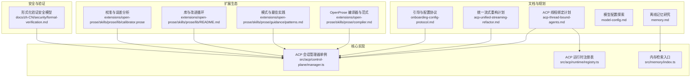
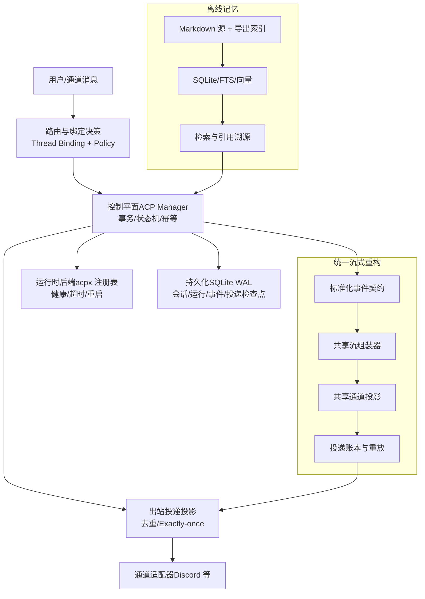
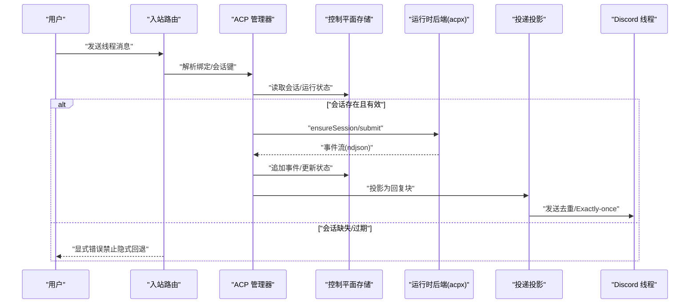
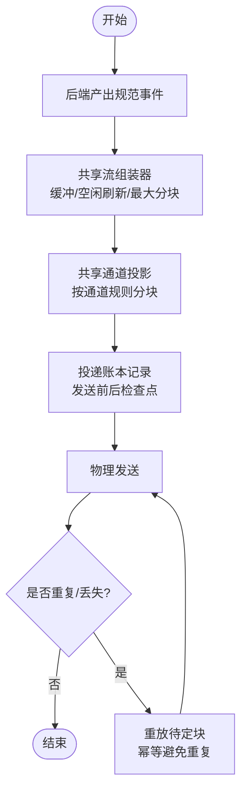
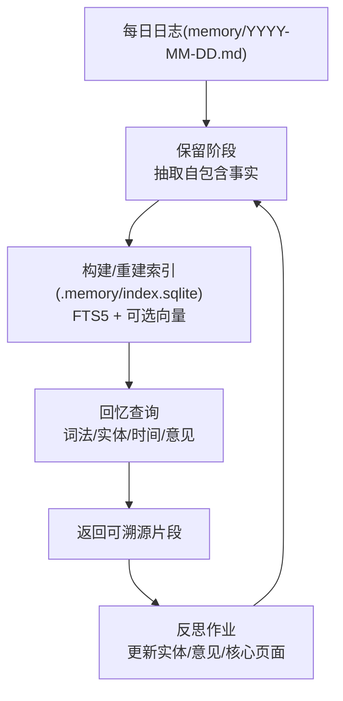
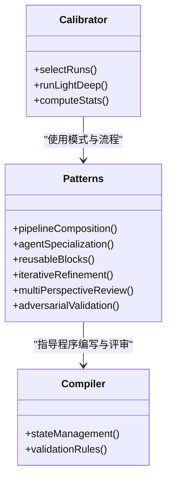
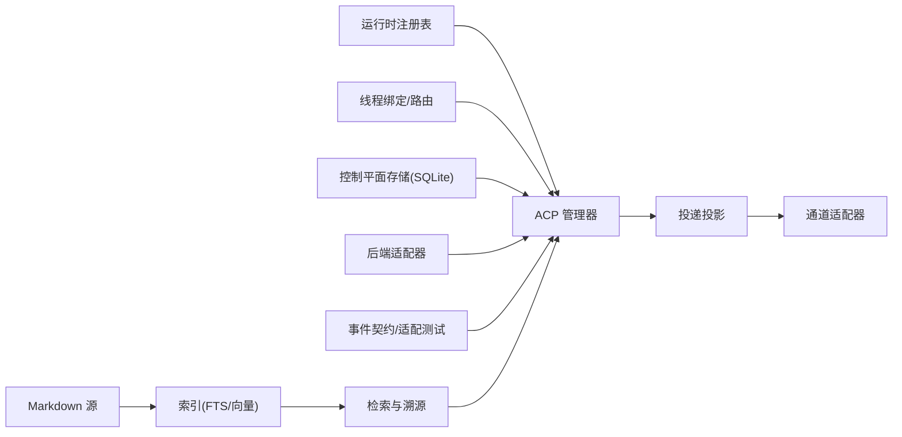

# 实验性功能

<cite>
**本文档引用的文件**
- [acp-thread-bound-agents.md](file://docs/experiments/plans/acp-thread-bound-agents.md)
- [acp-unified-streaming-refactor.md](file://docs/experiments/plans/acp-unified-streaming-refactor.md)
- [memory.md](file://docs/experiments/research/memory.md)
- [model-config.md](file://docs/experiments/proposals/model-config.md)
- [onboarding-config-protocol.md](file://docs/experiments/onboarding-config-protocol.md)
- [manager.ts](file://src/acp/control-plane/manager.ts)
- [registry.ts](file://src/acp/runtime/registry.ts)
- [index.ts](file://src/memory/index.ts)
- [warning-filter.test.ts](file://src/infra/warning-filter.test.ts)
- [compiler.md](file://extensions/open-prose/skills/prose/compiler.md)
- [patterns.md](file://extensions/open-prose/skills/prose/guidance/patterns.md)
- [README.md](file://extensions/open-prose/skills/prose/lib/README.md)
- [calibrator.prose](file://extensions/open-prose/skills/prose/lib/calibrator.prose)
- [formal-verification.md](file://docs/zh-CN/security/formal-verification.md)
</cite>

## 目录

1. [引言](#引言)
2. [项目结构](#项目结构)
3. [核心组件](#核心组件)
4. [架构总览](#架构总览)
5. [详细组件分析](#详细组件分析)
6. [依赖关系分析](#依赖关系分析)
7. [性能考量](#性能考量)
8. [故障排查指南](#故障排查指南)
9. [结论](#结论)
10. [附录](#附录)

## 引言

本文件聚焦 OpenClaw 的实验性功能与探索性设计，覆盖当前正在开发与测试的新能力、创新性架构与方法论。内容以“实验性计划”“研究笔记”“提案”等文档为基础，结合核心实现模块与扩展生态，系统阐述目标、技术路线、关键约束、评估标准与落地步骤，并提供使用指南、配置要点与参与测试反馈的路径，帮助研究人员与早期采用者深入理解并参与系统演进。

## 项目结构

实验性功能主要分布在以下区域：

- 文档层：位于 docs/experiments 下的计划、提案与研究笔记，定义目标、范围与阶段性推进策略
- 核心实现：src/acp 控制平面与运行时注册表、src/memory 离线记忆系统入口等
- 扩展生态：extensions/open-prose 提供基于子代理的工程化工作流与评估范式
- 安全与验证：docs/zh-CN/security/formal-verification.md 展示形式化安全模型现状与方法

图表来源

- [acp-thread-bound-agents.md](file://docs/experiments/plans/acp-thread-bound-agents.md#L1-L800)
- [acp-unified-streaming-refactor.md](file://docs/experiments/plans/acp-unified-streaming-refactor.md#L1-L97)
- [memory.md](file://docs/experiments/research/memory.md#L1-L229)
- [model-config.md](file://docs/experiments/proposals/model-config.md#L1-L37)
- [onboarding-config-protocol.md](file://docs/experiments/onboarding-config-protocol.md#L1-L41)
- [manager.ts](file://src/acp/control-plane/manager.ts#L1-L30)
- [registry.ts](file://src/acp/runtime/registry.ts#L1-L119)
- [index.ts](file://src/memory/index.ts#L1-L8)
- [compiler.md](file://extensions/open-prose/skills/prose/compiler.md#L2631-L2646)
- [patterns.md](file://extensions/open-prose/skills/prose/guidance/patterns.md#L52-L114)
- [README.md](file://extensions/open-prose/skills/prose/lib/README.md#L25-L46)
- [calibrator.prose](file://extensions/open-prose/skills/prose/lib/calibrator.prose#L47-L142)
- [formal-verification.md](file://docs/zh-CN/security/formal-verification.md#L1-L46)

章节来源

- [acp-thread-bound-agents.md](file://docs/experiments/plans/acp-thread-bound-agents.md#L1-L800)
- [acp-unified-streaming-refactor.md](file://docs/experiments/plans/acp-unified-streaming-refactor.md#L1-L97)
- [memory.md](file://docs/experiments/research/memory.md#L1-L229)
- [model-config.md](file://docs/experiments/proposals/model-config.md#L1-L37)
- [onboarding-config-protocol.md](file://docs/experiments/onboarding-config-protocol.md#L1-L41)
- [manager.ts](file://src/acp/control-plane/manager.ts#L1-L30)
- [registry.ts](file://src/acp/runtime/registry.ts#L1-L119)
- [index.ts](file://src/memory/index.ts#L1-L8)
- [compiler.md](file://extensions/open-prose/skills/prose/compiler.md#L2631-L2646)
- [patterns.md](file://extensions/open-prose/skills/prose/guidance/patterns.md#L52-L114)
- [README.md](file://extensions/open-prose/skills/prose/lib/README.md#L25-L46)
- [calibrator.prose](file://extensions/open-prose/skills/prose/lib/calibrator.prose#L47-L142)
- [formal-verification.md](file://docs/zh-CN/security/formal-verification.md#L1-L46)

## 核心组件

- ACP 控制平面与运行时适配
  - ACP 会话管理器单例负责控制平面编排、生命周期与幂等事务
  - ACP 运行时注册表提供后端注册、健康检查与选择逻辑
- 离线记忆系统入口
  - 内存检索管理器对外暴露检索与嵌入探测接口，支撑离线知识召回
- OpenProse 工作流与评估范式
  - 提供可复用的子代理模式、块（block）与改进循环，支持校准与误差分析
- 安全与验证
  - 形式化安全模型（TLA+/TLC）作为可执行的安全回归测试基线

章节来源

- [manager.ts](file://src/acp/control-plane/manager.ts#L1-L30)
- [registry.ts](file://src/acp/runtime/registry.ts#L1-L119)
- [index.ts](file://src/memory/index.ts#L1-L8)
- [README.md](file://extensions/open-prose/skills/prose/lib/README.md#L25-L46)
- [formal-verification.md](file://docs/zh-CN/security/formal-verification.md#L1-L46)

## 架构总览

实验性功能围绕“控制平面 + 运行时适配 + 统一流式管线 + 离线记忆 + 工程化评估”的方向演进，强调一致性、可观测性与可恢复性。

图表来源

- [acp-thread-bound-agents.md](file://docs/experiments/plans/acp-thread-bound-agents.md#L105-L248)
- [acp-unified-streaming-refactor.md](file://docs/experiments/plans/acp-unified-streaming-refactor.md#L21-L68)
- [memory.md](file://docs/experiments/research/memory.md#L57-L150)

## 详细组件分析

### ACP 线程绑定与控制平面

- 目标与体验
  - 将 ACP 编码代理以“线程绑定会话”的方式在 Discord 等线程通道中进行生产级生命周期与恢复
  - 明确的会话/运行状态机、原子化事务与幂等键，确保重复提交不产生重复输出
- 关键约束
  - 控制平面必须在核心实现，运行时后端可插拔（acpx 首个后端）
  - 出站投递仅走绑定线程，避免与父频道重复
- 数据与持久化
  - 专用 SQLite 表：会话、运行、绑定、事件、投递检查点、幂等键
  - WAL 模式保证崩溃恢复与可回放
- 配置与命令
  - 核心开关与后端选择、流式节流参数、TTL 策略、诊断命令
  - 新增 ACP 命令族：spawn/cancel/steer/close/sessions
- 路由与交付
  - 入站：线程绑定优先解析到 ACP 会话键
  - 出站：事件投影 + 检查点重放，保证 Exactly-once
- 可观测性
  - 指标：spawn 成功/失败、运行时延分位、重启次数、过期绑定检测、重放命中率、限流计数
  - 日志：结构化键值，状态机转换日志
  - 诊断：/acp sessions、/acp doctor

图表来源

- [acp-thread-bound-agents.md](file://docs/experiments/plans/acp-thread-bound-agents.md#L229-L304)
- [acp-thread-bound-agents.md](file://docs/experiments/plans/acp-thread-bound-agents.md#L343-L372)
- [acp-thread-bound-agents.md](file://docs/experiments/plans/acp-thread-bound-agents.md#L545-L575)

章节来源

- [acp-thread-bound-agents.md](file://docs/experiments/plans/acp-thread-bound-agents.md#L1-L800)

### 统一运行时流式重构

- 目标
  - 主、子代理与 ACP 共享同一流式管线，确保格式化、分块、投递顺序与崩溃恢复一致
- 事件契约
  - canonical 事件：turn_started/text_delta/block_final/tool_started/tool_finished/status/turn_completed/turn_failed/turn_cancelled
- 工作流
  - 1. 后端只产出规范事件；2) 共享流组装器；3) 共享通道投影；4) 共享投递账本与重放；5) 分阶段切换
- 风险与缓解
  - 行为回退：阴影模式对比 + 合约测试 + 通道 e2e
  - 重复发送：持久化投递 ID + 幂等重放

图表来源

- [acp-unified-streaming-refactor.md](file://docs/experiments/plans/acp-unified-streaming-refactor.md#L31-L74)

章节来源

- [acp-unified-streaming-refactor.md](file://docs/experiments/plans/acp-unified-streaming-refactor.md#L1-L97)

### 离线记忆系统（Markdown 源 + 导出索引）

- 设计目标
  - 以 Markdown 为人类可审阅的源，辅以结构化检索（FTS/实体/意见），支持保留/回忆/反思闭环
- 存储布局
  - 源：每日日志 + 稳定页面（bank/\*）
  - 导出：SQLite 索引（FTS5 + 可选向量）
- 操作循环
  - 保留：从日志抽取“自包含事实”，标注类型/实体/意见置信度
  - 回忆：词法/实体/时间/意见查询，返回可溯源片段
  - 反思：更新实体摘要/意见置信度，必要时建议编辑核心页面
- 集成建议
  - 深度集成 OpenClaw，提供 CLI 工具调用（recall/reflect），并保持独立库便于复用

图表来源

- [memory.md](file://docs/experiments/research/memory.md#L103-L150)
- [memory.md](file://docs/experiments/research/memory.md#L169-L189)

章节来源

- [memory.md](file://docs/experiments/research/memory.md#L1-L229)

### 模型配置探索（认证与回退）

- 动机
  - 多认证配置、简单模型选择、文本/图像路由分离
- 方向
  - provider/model 简单选择 + 多配置文件序 + 全局回退列表 + 图像路由按需覆盖
- 开放问题
  - 配置轮换粒度（按提供方 vs 按模型）、UI 表达、从旧配置迁移

章节来源

- [model-config.md](file://docs/experiments/proposals/model-config.md#L1-L37)

### 引导与配置协议（跨端一致性）

- 目的
  - CLI、macOS 应用、Web UI 共享引导向导与配置模式
- 组件
  - 引导引擎（共享会话/提示/状态）
  - 网关 RPC 暴露向导与配置模式端点
  - UI Hint（标签/帮助/分组/排序/高级/敏感/占位符）
- 协议
  - wizard.start/next/cancel/status
  - config.schema

章节来源

- [onboarding-config-protocol.md](file://docs/experiments/onboarding-config-protocol.md#L1-L41)

### OpenProse 工程化范式与评估

- 改进循环
  - 运行程序 → 检查器 → VM 改进者 → PR，形成递归改进闭环
- 支撑分析
  - 成本分析器、校准器、误差取证
- 工作流模式
  - 管道组合、代理专精、可复用块、迭代优化、多视角评审、对抗验证

图表来源

- [README.md](file://extensions/open-prose/skills/prose/lib/README.md#L25-L46)
- [patterns.md](file://extensions/open-prose/skills/prose/guidance/patterns.md#L52-L114)
- [patterns.md](file://extensions/open-prose/skills/prose/guidance/patterns.md#L379-L425)
- [compiler.md](file://extensions/open-prose/skills/prose/compiler.md#L2631-L2646)
- [calibrator.prose](file://extensions/open-prose/skills/prose/lib/calibrator.prose#L47-L142)

章节来源

- [README.md](file://extensions/open-prose/skills/prose/lib/README.md#L101-L109)
- [patterns.md](file://extensions/open-prose/skills/prose/guidance/patterns.md#L52-L114)
- [patterns.md](file://extensions/open-prose/skills/prose/guidance/patterns.md#L379-L425)
- [compiler.md](file://extensions/open-prose/skills/prose/compiler.md#L2631-L2646)
- [calibrator.prose](file://extensions/open-prose/skills/prose/lib/calibrator.prose#L47-L142)

### 安全与验证（形式化模型）

- 目标
  - 对最高风险路径给出可机器检查的安全论证（授权、会话隔离、工具门控、配置错误安全）
- 现状
  - TLA+/TLC 模型检查 + 攻击者驱动回归测试
- 注意事项
  - 模型与代码可能存在偏差；结果受状态空间限制；部分声明依赖正确部署/配置输入

章节来源

- [formal-verification.md](file://docs/zh-CN/security/formal-verification.md#L1-L46)

## 依赖关系分析

- ACP 控制平面依赖
  - 运行时注册表：后端健康检查与选择
  - 线程绑定与路由：入站解析与失败关闭策略
  - 存储：事务边界与检查点
  - 出站投影：Exactly-once 投递
- 统一流式重构依赖
  - 后端合约：严格事件 schema 与适配测试
  - 共享处理器：文本缓冲/空闲刷新/最大分块/完成刷新
  - 投递账本：持久化交付 ID 与重放
- 离线记忆依赖
  - Markdown 源文件与稳定页面
  - SQLite/FTS/向量索引重建
- OpenProse 依赖
  - 子代理模式与块抽象
  - 校准与误差分析流程

图表来源

- [registry.ts](file://src/acp/runtime/registry.ts#L49-L109)
- [acp-thread-bound-agents.md](file://docs/experiments/plans/acp-thread-bound-agents.md#L131-L185)
- [acp-unified-streaming-refactor.md](file://docs/experiments/plans/acp-unified-streaming-refactor.md#L43-L68)
- [memory.md](file://docs/experiments/research/memory.md#L87-L102)

章节来源

- [registry.ts](file://src/acp/runtime/registry.ts#L1-L119)
- [acp-thread-bound-agents.md](file://docs/experiments/plans/acp-thread-bound-agents.md#L1-L800)
- [acp-unified-streaming-refactor.md](file://docs/experiments/plans/acp-unified-streaming-refactor.md#L1-L97)
- [memory.md](file://docs/experiments/research/memory.md#L1-L229)

## 性能考量

- ACP
  - 长驻会话进程减少启动开销，配合并发上限与退避策略提升稳定性
  - 流式分块与速率限制感知的合并窗口，降低通道限流风险
- 统一流式
  - 共享处理器减少重复实现与漂移，提高一致性与可维护性
- 离线记忆
  - SQLite FTS5 提供零 ML 的快速检索；向量仅在规模/质量需求时引入
- OpenProse
  - 子代理并行与块复用降低总体计算与交互成本

## 故障排查指南

- ACP
  - 后端缺失/不可用：检查 acp.backend 与后端注册状态，确认健康检查
  - 过期绑定：启用自动清理策略或显式诊断命令定位
  - 重复投递/乱序：核查投递检查点与事件序列，确认 Exactly-once 投影
  - 配置混淆：核对账户/频道/全局开关与派生值
- 统一流式
  - 事件契约不匹配：运行适配器合约测试，修正后端事件输出
  - 通道特定问题：在投影层修复，保持管道无状态
- 离线记忆
  - 索引损坏：备份/恢复钩子 + 迁移烟雾测试 + 只读诊断
  - 回放异常：检查交付 ID 与重放边界，确保幂等
- OpenProse
  - 校准偏差：使用校准器与误差取证，识别昂贵评估的可靠代理

章节来源

- [acp-thread-bound-agents.md](file://docs/experiments/plans/acp-thread-bound-agents.md#L737-L751)
- [acp-unified-streaming-refactor.md](file://docs/experiments/plans/acp-unified-streaming-refactor.md#L81-L89)
- [memory.md](file://docs/experiments/research/memory.md#L191-L215)
- [calibrator.prose](file://extensions/open-prose/skills/prose/lib/calibrator.prose#L47-L142)

## 结论

OpenClaw 的实验性功能以“控制平面 + 插件化运行时 + 统一流式 + 离线记忆 + 工程化评估”为主线，既保证工程落地的可控性，又为长期演进预留清晰的边界与契约。通过严格的事务与幂等、可观测性与诊断、以及形式化安全模型的补充，实验性功能在安全性与可用性之间取得平衡，为研究人员与早期采用者提供了深入参与系统演进的机会。

## 附录

- 使用指南与配置要点
  - ACP
    - 启用与后端选择：acp.enabled、acp.dispatch.enabled、acp.backend
    - 流式与投递：acp.stream._、acp.controlPlane._
    - 生命周期：/acp spawn/cancel/steer/close/sessions
  - 统一流式
    - 事件契约与适配测试，逐步切换后端
  - 离线记忆
    - 配置工作区路径与 bank 页面，使用 CLI recall/reflect
  - OpenProse
    - 使用子代理与块，建立校准与误差分析流程
- 参与测试与反馈
  - 通过文档中的验收清单与测试地图进行自测
  - 提交 e2e 场景与回归用例，协助完善合约测试
  - 在形式化验证模型仓库中贡献或复现安全声明

章节来源

- [acp-thread-bound-agents.md](file://docs/experiments/plans/acp-thread-bound-agents.md#L343-L372)
- [acp-unified-streaming-refactor.md](file://docs/experiments/plans/acp-unified-streaming-refactor.md#L69-L74)
- [memory.md](file://docs/experiments/research/memory.md#L169-L189)
- [README.md](file://extensions/open-prose/skills/prose/lib/README.md#L25-L46)
- [formal-verification.md](file://docs/zh-CN/security/formal-verification.md#L41-L46)
