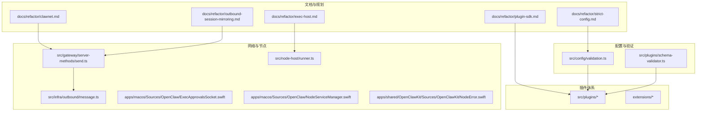
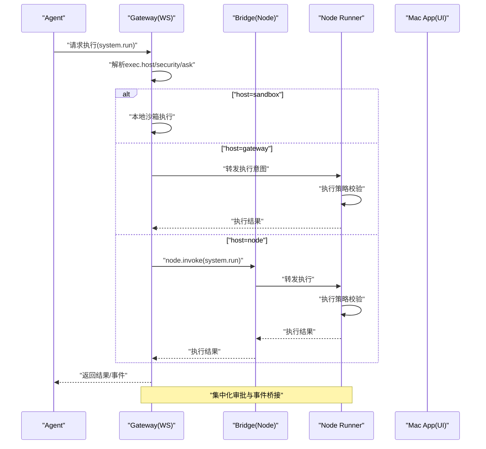
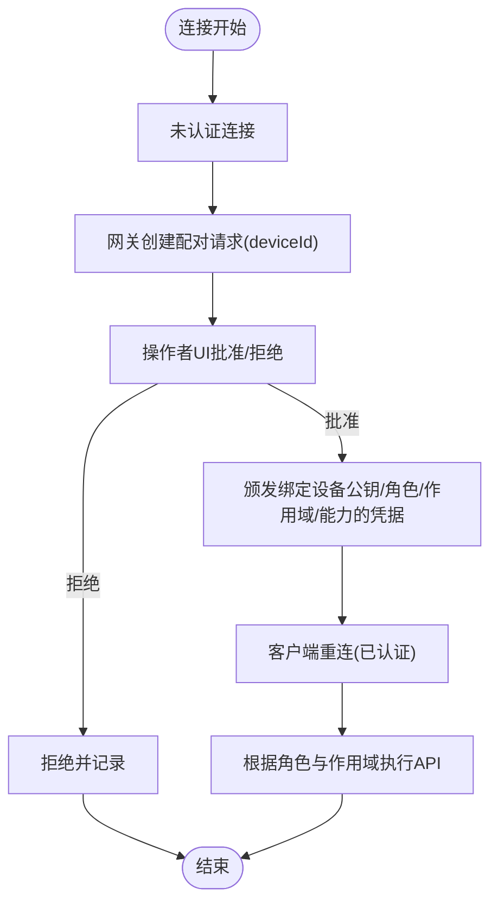
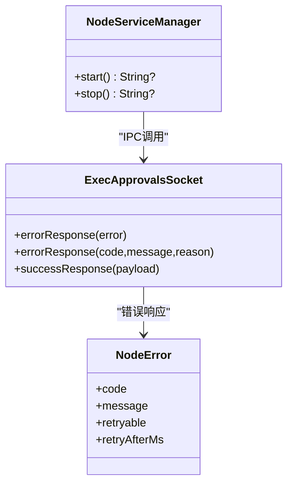
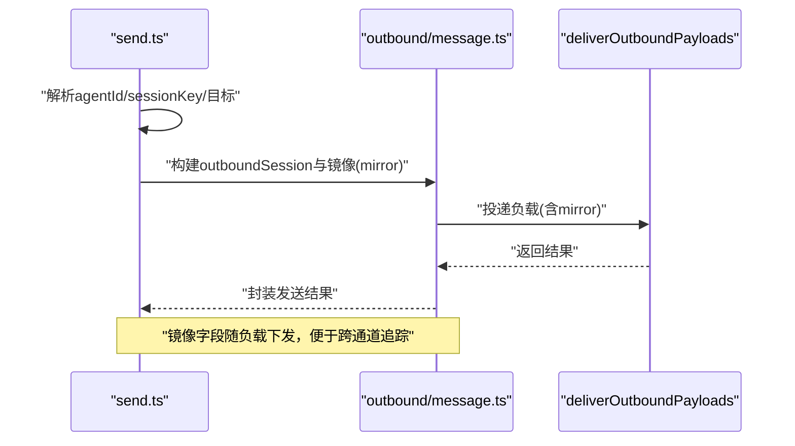
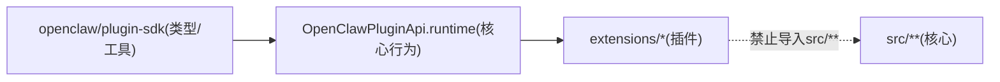
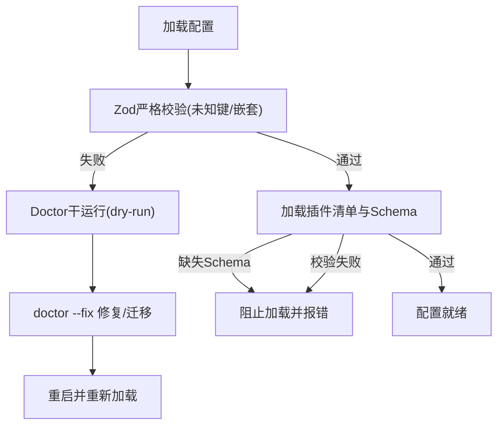
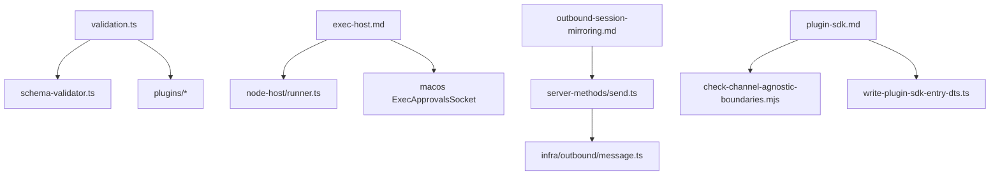

# 系统重构

<cite>
**本文引用的文件**
- [README.md](file://README.md)
- [docs/refactor/clawnet.md](file://docs/refactor/clawnet.md)
- [docs/refactor/exec-host.md](file://docs/refactor/exec-host.md)
- [docs/refactor/outbound-session-mirroring.md](file://docs/refactor/outbound-session-mirroring.md)
- [docs/refactor/plugin-sdk.md](file://docs/refactor/plugin-sdk.md)
- [docs/refactor/strict-config.md](file://docs/refactor/strict-config.md)
- [src/config/validation.ts](file://src/config/validation.ts)
- [src/plugins/schema-validator.ts](file://src/plugins/schema-validator.ts)
- [src/gateway/sessions-patch.test.ts](file://src/gateway/sessions-patch.test.ts)
- [src/gateway/server-methods/send.ts](file://src/gateway/server-methods/send.ts)
- [src/infra/outbound/message.ts](file://src/infra/outbound/message.ts)
- [src/node-host/runner.ts](file://src/node-host/runner.ts)
- [apps/macos/Sources/OpenClaw/ExecApprovalsSocket.swift](file://apps/macos/Sources/OpenClaw/ExecApprovalsSocket.swift)
- [apps/macos/Sources/OpenClaw/NodeServiceManager.swift](file://apps/macos/Sources/OpenClaw/NodeServiceManager.swift)
- [apps/shared/OpenClawKit/Sources/OpenClawKit/NodeError.swift](file://apps/shared/OpenClawKit/Sources/OpenClawKit/NodeError.swift)
- [extensions/phone-control/index.ts](file://extensions/phone-control/index.ts)
- [scripts/check-channel-agnostic-boundaries.mjs](file://scripts/check-channel-agnostic-boundaries.mjs)
- [scripts/write-plugin-sdk-entry-dts.ts](file://scripts/write-plugin-sdk-entry-dts.ts)
</cite>

## 目录

1. [简介](#简介)
2. [项目结构](#项目结构)
3. [核心组件](#核心组件)
4. [架构总览](#架构总览)
5. [详细组件分析](#详细组件分析)
6. [依赖关系分析](#依赖关系分析)
7. [性能考量](#性能考量)
8. [故障排查指南](#故障排查指南)
9. [结论](#结论)
10. [附录](#附录)

## 简介

本技术文档围绕 OpenClaw 系统重构展开，聚焦四大主题：clawnet 网络协议与身份模型重构、执行主机与审批流程优化、出站会话镜像技术、以及插件 SDK 改进。文档同时阐述严格配置验证机制的设计原理与实现细节，提供重构前后架构对比、性能提升效果、迁移指南、代码示例路径、配置变更要点与最佳实践，并总结重构过程中的技术挑战与解决方案。

## 项目结构

OpenClaw 采用多平台、多子系统的工程组织方式，核心重构涉及以下关键目录与文件：

- 文档与规划：docs/refactor 下的 Clawnet、执行主机、出站镜像、插件 SDK、严格配置等设计文档
- 配置与验证：src/config 下的 Zod Schema、验证器与插件 Schema 校验
- 网络与节点：src/gateway、src/node-host、apps/macos、apps/shared 等
- 出站镜像：src/gateway/server-methods、src/infra/outbound
- 插件体系：src/plugins、extensions 下各通道插件
- 脚本与工具：scripts 下的边界检查与 SDK 类型导出脚本

图表来源

- [docs/refactor/clawnet.md](file://docs/refactor/clawnet.md#L1-L418)
- [docs/refactor/exec-host.md](file://docs/refactor/exec-host.md#L1-L317)
- [docs/refactor/outbound-session-mirroring.md](file://docs/refactor/outbound-session-mirroring.md#L1-L90)
- [docs/refactor/plugin-sdk.md](file://docs/refactor/plugin-sdk.md#L1-L215)
- [docs/refactor/strict-config.md](file://docs/refactor/strict-config.md#L1-L94)
- [src/config/validation.ts](file://src/config/validation.ts#L1-L454)
- [src/plugins/schema-validator.ts](file://src/plugins/schema-validator.ts#L1-L45)
- [src/gateway/server-methods/send.ts](file://src/gateway/server-methods/send.ts#L249-L271)
- [src/infra/outbound/message.ts](file://src/infra/outbound/message.ts#L216-L252)
- [src/node-host/runner.ts](file://src/node-host/runner.ts#L121-L161)
- [apps/macos/Sources/OpenClaw/ExecApprovalsSocket.swift](file://apps/macos/Sources/OpenClaw/ExecApprovalsSocket.swift#L513-L555)
- [apps/macos/Sources/OpenClaw/NodeServiceManager.swift](file://apps/macos/Sources/OpenClaw/NodeServiceManager.swift#L1-L48)
- [apps/shared/OpenClawKit/Sources/OpenClawKit/NodeError.swift](file://apps/shared/OpenClawKit/Sources/OpenClawKit/NodeError.swift#L1-L28)

章节来源

- [README.md](file://README.md#L1-L556)

## 核心组件

- Clawnet 协议与身份模型：统一 WS 控制面协议，明确节点与操作者角色，引入设备绑定认证与 TLS 指纹校验，集中化审批流。
- 执行主机与审批：新增 exec.host/exec.security/exec.ask 策略，支持 sandbox/gateway/node 三类执行宿主；headless runner + 本地 IPC 的 UI 集成；执行事件桥接到网关系统事件队列。
- 出站会话镜像：在发送流程中生成镜像数据，自动派生会话键并规范化大小写，确保跨通道一致性与可观测性。
- 插件 SDK：分离 SDK（类型与工具）与运行时（核心行为注入），约束插件不得直接导入 src/\*\*，通过 api.runtime 访问核心能力。
- 严格配置验证：拒绝未知键、强制插件配置 Schema 校验、Doctor 干运行与修复流程、命令级门禁。

章节来源

- [docs/refactor/clawnet.md](file://docs/refactor/clawnet.md#L11-L418)
- [docs/refactor/exec-host.md](file://docs/refactor/exec-host.md#L10-L317)
- [docs/refactor/outbound-session-mirroring.md](file://docs/refactor/outbound-session-mirroring.md#L56-L90)
- [docs/refactor/plugin-sdk.md](file://docs/refactor/plugin-sdk.md#L1-L215)
- [docs/refactor/strict-config.md](file://docs/refactor/strict-config.md#L10-L94)
- [src/config/validation.ts](file://src/config/validation.ts#L87-L171)
- [src/plugins/schema-validator.ts](file://src/plugins/schema-validator.ts#L1-L45)

## 架构总览

重构后系统以“统一协议 + 明确角色 + 集中式审批 + 严格配置”为核心，形成如下交互闭环：

图表来源

- [docs/refactor/exec-host.md](file://docs/refactor/exec-host.md#L232-L250)
- [docs/refactor/clawnet.md](file://docs/refactor/clawnet.md#L216-L247)

## 详细组件分析

### Clawnet 网络与身份模型

- 单一 WS 协议承载所有客户端（macOS/CLI/iOS/Android/headless node），区分节点（capability host）与操作者（control plane）角色，支持按作用域（read/write/admin/approvals/pairing）授权。
- 统一配对流程：未认证连接由网关创建配对请求，操作者端 UI 接收并批准，颁发绑定设备公钥、角色、作用域与能力的凭据；客户端持久化令牌并重连。
- TLS 与指纹：复用 Bridge TLS 运行时与指纹校验，WS 层同样支持 TLS 与可选指纹校验，Discovery 仅提供定位提示。
- 审批集中化：执行意图由网关发起审批记录，广播至所有操作者 UI，首个响应生效，超时默认拒绝，节点运行时不再弹窗 UI。

图表来源

- [docs/refactor/clawnet.md](file://docs/refactor/clawnet.md#L155-L190)
- [docs/refactor/clawnet.md](file://docs/refactor/clawnet.md#L216-L247)

章节来源

- [docs/refactor/clawnet.md](file://docs/refactor/clawnet.md#L111-L247)

### 执行主机与审批流程

- 配置与策略：
  - exec.host: sandbox/gateway/node
  - exec.security: deny/allowlist/full
  - exec.ask: off/on-miss/always
  - exec.node: 节点绑定
- 默认安全：exec.host 默认 sandbox，gateway/node 默认 security=deny，ask=on-miss；未绑定节点时，代理仍受策略限制。
- 审批存储：~/.openclaw/exec-approvals.json，包含 socket、defaults、agents 三部分；askFallback 用于 UI 不可用时的回退策略。
- 运行时服务：headless runner 作为可移植执行目标；macOS UI 通过 Unix Socket + Token + HMAC + TTL 与 runner 通信；事件通过 Bridge 传输至网关系统事件队列。
- 输出上限：合并 stdout/stderr 截断并保留尾部，清晰标注截断。

图表来源

- [apps/macos/Sources/OpenClaw/ExecApprovalsSocket.swift](file://apps/macos/Sources/OpenClaw/ExecApprovalsSocket.swift#L513-L555)
- [apps/macos/Sources/OpenClaw/NodeServiceManager.swift](file://apps/macos/Sources/OpenClaw/NodeServiceManager.swift#L1-L48)
- [apps/shared/OpenClawKit/Sources/OpenClawKit/NodeError.swift](file://apps/shared/OpenClawKit/Sources/OpenClawKit/NodeError.swift#L1-L28)

章节来源

- [docs/refactor/exec-host.md](file://docs/refactor/exec-host.md#L10-L317)
- [src/node-host/runner.ts](file://src/node-host/runner.ts#L121-L161)

### 出站会话镜像技术

- 发送流程镜像：在 deliverOutboundPayloads 前构建镜像对象，包含 sessionKey、agentId、text、mediaUrls 等字段；若未显式提供 sessionKey，则基于目标与默认代理派生并规范化大小写。
- 测试覆盖：包含 Slack thread、Telegram topic、dmScope identityLinks 等场景；验证镜像 sessionKey 大小写规范化与派生优先级。
- 事件桥接：节点侧执行生命周期事件通过 Bridge 事件映射为系统事件，供代理提示展示。

图表来源

- [src/gateway/server-methods/send.ts](file://src/gateway/server-methods/send.ts#L249-L271)
- [src/infra/outbound/message.ts](file://src/infra/outbound/message.ts#L216-L252)
- [docs/refactor/outbound-session-mirroring.md](file://docs/refactor/outbound-session-mirroring.md#L56-L90)

章节来源

- [src/gateway/server-methods/send.ts](file://src/gateway/server-methods/send.ts#L249-L271)
- [src/infra/outbound/message.ts](file://src/infra/outbound/message.ts#L216-L252)
- [docs/refactor/outbound-session-mirroring.md](file://docs/refactor/outbound-session-mirroring.md#L56-L90)

### 插件 SDK 改进

- 双层架构：
  - SDK（编译期、稳定、可发布）：类型、工具与配置辅助，无运行时状态与副作用
  - 运行时（注入式）：通过 OpenClawPluginApi.runtime 访问核心行为，插件不得导入 src/\*\*
- 迁移策略：分阶段替换 core-bridge、清理重复桥接、验证路由/配对/允许列表/提及逻辑、强制禁止 extensions/** 导入 src/**、添加 SDK/运行时版本兼容检查
- 类型导出：通过脚本生成稳定入口类型声明，确保 d.ts 与运行时 specifier 对齐

图表来源

- [docs/refactor/plugin-sdk.md](file://docs/refactor/plugin-sdk.md#L19-L151)
- [scripts/check-channel-agnostic-boundaries.mjs](file://scripts/check-channel-agnostic-boundaries.mjs#L156-L273)
- [scripts/write-plugin-sdk-entry-dts.ts](file://scripts/write-plugin-sdk-entry-dts.ts#L1-L15)

章节来源

- [docs/refactor/plugin-sdk.md](file://docs/refactor/plugin-sdk.md#L1-L215)
- [scripts/check-channel-agnostic-boundaries.mjs](file://scripts/check-channel-agnostic-boundaries.mjs#L144-L306)
- [scripts/write-plugin-sdk-entry-dts.ts](file://scripts/write-plugin-sdk-entry-dts.ts#L1-L15)

### 严格配置验证机制

- 设计原则：拒绝未知键（根与嵌套）、强制插件配置 Schema 校验、移除加载时自动迁移、启动时干运行 Doctor、无效配置下仅允许诊断命令
- 实现要点：
  - Zod Schema 严格对象校验，禁止透传未知键（根 $schema 除外）
  - 插件 Manifest 必须提供 JSON Schema，缺失或校验失败则阻止加载并给出明确错误
  - Doctor 干运行输出摘要与可操作错误，openclaw doctor --fix 应用迁移并清理未知键
  - CLI 命令门禁：无效配置时仅允许 doctor/logs/health/help/status/gateway status 等诊断命令

图表来源

- [docs/refactor/strict-config.md](file://docs/refactor/strict-config.md#L24-L68)
- [src/config/validation.ts](file://src/config/validation.ts#L87-L171)
- [src/plugins/schema-validator.ts](file://src/plugins/schema-validator.ts#L1-L45)

章节来源

- [docs/refactor/strict-config.md](file://docs/refactor/strict-config.md#L10-L94)
- [src/config/validation.ts](file://src/config/validation.ts#L87-L171)
- [src/plugins/schema-validator.ts](file://src/plugins/schema-validator.ts#L1-L45)

## 依赖关系分析

- 配置验证链路：Zod Schema → 插件 Schema 校验 → 通道与心跳目标校验 → 插件启用/禁用与内存槽决策
- 执行主机链路：工具参数 → 代理覆盖 → 全局默认 → 安全策略与审批 → 节点选择与绑定
- 出站镜像链路：发送入口 → 会话派生/规范化 → 镜像构建 → 负载投递
- 插件边界：lint/CI 检查禁止 extensions/** 导入 src/**，SDK 与运行时版本兼容性校验

图表来源

- [src/config/validation.ts](file://src/config/validation.ts#L173-L453)
- [src/plugins/schema-validator.ts](file://src/plugins/schema-validator.ts#L1-L45)
- [src/node-host/runner.ts](file://src/node-host/runner.ts#L121-L161)
- [apps/macos/Sources/OpenClaw/ExecApprovalsSocket.swift](file://apps/macos/Sources/OpenClaw/ExecApprovalsSocket.swift#L513-L555)
- [docs/refactor/outbound-session-mirroring.md](file://docs/refactor/outbound-session-mirroring.md#L56-L90)
- [src/gateway/server-methods/send.ts](file://src/gateway/server-methods/send.ts#L249-L271)
- [src/infra/outbound/message.ts](file://src/infra/outbound/message.ts#L216-L252)
- [docs/refactor/plugin-sdk.md](file://docs/refactor/plugin-sdk.md#L183-L193)
- [scripts/check-channel-agnostic-boundaries.mjs](file://scripts/check-channel-agnostic-boundaries.mjs#L156-L273)
- [scripts/write-plugin-sdk-entry-dts.ts](file://scripts/write-plugin-sdk-entry-dts.ts#L1-L15)

章节来源

- [src/config/validation.ts](file://src/config/validation.ts#L173-L453)
- [docs/refactor/plugin-sdk.md](file://docs/refactor/plugin-sdk.md#L183-L193)

## 性能考量

- 执行主机分流：通过 exec.host 将高风险命令路由至 sandbox 或 node，降低 gateway 主机压力；allowlist 与 ask 模式减少 UI 阻塞与重试成本。
- 出站镜像：镜像数据仅在必要时携带，避免冗余负载；会话键规范化减少重复派生与缓存失效。
- 插件 SDK：类型与工具集中于 SDK，减少运行时开销；通过别名与缓存提升加载效率。
- 配置验证：严格 Schema 校验与 Doctor 干运行在启动阶段完成，避免运行时反复校验带来的抖动。

## 故障排查指南

- 执行审批失败
  - 检查 ~/.openclaw/exec-approvals.json 结构与权限（0600），确认 askFallback 设置
  - macOS UI 通过 Unix Socket 与 runner 通信，确认 socket 路径、token 与 HMAC 校验
  - 参考路径：[apps/macos/Sources/OpenClaw/ExecApprovalsSocket.swift](file://apps/macos/Sources/OpenClaw/ExecApprovalsSocket.swift#L513-L555)
- 节点服务不可用
  - 使用 NodeServiceManager 启停服务，查看错误信息与日志
  - 参考路径：[apps/macos/Sources/OpenClaw/NodeServiceManager.swift](file://apps/macos/Sources/OpenClaw/NodeServiceManager.swift#L1-L48)
- 出站镜像异常
  - 确认 sessionKey 是否显式提供或正确派生；检查镜像字段大小写规范化
  - 参考路径：[src/gateway/server-methods/send.ts](file://src/gateway/server-methods/send.ts#L249-L271)、[src/infra/outbound/message.ts](file://src/infra/outbound/message.ts#L216-L252)
- 插件加载失败
  - 确认 openclaw.plugin.json 存在且包含有效 JSON Schema；Doctor 报错中定位具体插件与路径
  - 参考路径：[src/config/validation.ts](file://src/config/validation.ts#L418-L438)、[src/plugins/schema-validator.ts](file://src/plugins/schema-validator.ts#L27-L44)
- 配置无效
  - 运行 openclaw doctor --fix 修复；仅诊断命令可执行
  - 参考路径：[docs/refactor/strict-config.md](file://docs/refactor/strict-config.md#L46-L68)

章节来源

- [apps/macos/Sources/OpenClaw/ExecApprovalsSocket.swift](file://apps/macos/Sources/OpenClaw/ExecApprovalsSocket.swift#L513-L555)
- [apps/macos/Sources/OpenClaw/NodeServiceManager.swift](file://apps/macos/Sources/OpenClaw/NodeServiceManager.swift#L1-L48)
- [src/gateway/server-methods/send.ts](file://src/gateway/server-methods/send.ts#L249-L271)
- [src/infra/outbound/message.ts](file://src/infra/outbound/message.ts#L216-L252)
- [src/config/validation.ts](file://src/config/validation.ts#L418-L438)
- [src/plugins/schema-validator.ts](file://src/plugins/schema-validator.ts#L27-L44)
- [docs/refactor/strict-config.md](file://docs/refactor/strict-config.md#L46-L68)

## 结论

本次重构以“统一协议、明确角色、集中审批、严格配置”为主线，显著提升了安全性与可维护性。Clawnet 将两类协议栈整合为单一 WS 协议，配合设备绑定认证与 TLS 指纹校验；执行主机与审批流程通过策略与 headless runner 实现跨平台一致性；出站镜像增强可观测性；插件 SDK 与边界检查确保生态稳定演进；严格配置验证与 Doctor 流程保障系统健康。整体迁移遵循分阶段、低风险策略，既保护存量配置，又为未来扩展奠定坚实基础。

## 附录

- 迁移步骤概览
  - 阶段 0：发布设计文档，盘点协议调用与审批流程
  - 阶段 1：在 WS 中增加角色/作用域参数与节点能力白名单
  - 阶段 2：并行保留 Bridge，新增 WS 节点支持，通过配置开关控制
  - 阶段 3：引入 WS 审批请求/响应事件，macOS UI 提示并响应，节点运行时停止弹窗
  - 阶段 4：WS 启用 TLS 与指纹校验
  - 阶段 5：迁移 iOS/Android/mac 节点到 WS，保留 Bridge 作为回退
  - 阶段 6：非本地连接要求基于密钥的身份标识，提供撤销与轮换 UI
- 最佳实践
  - 默认 exec.host=sandbox，gateway/node 默认 security=deny，ask=on-miss
  - 使用 exec.node 绑定节点，避免多节点歧义导致的错误
  - 插件必须提供 JSON Schema，避免加载失败
  - 配置无效时仅执行诊断命令，先运行 doctor --fix
  - 出站镜像仅在需要时携带媒体 URL，避免冗余负载

章节来源

- [docs/refactor/clawnet.md](file://docs/refactor/clawnet.md#L301-L340)
- [docs/refactor/exec-host.md](file://docs/refactor/exec-host.md#L268-L297)
- [docs/refactor/strict-config.md](file://docs/refactor/strict-config.md#L12-L23)
