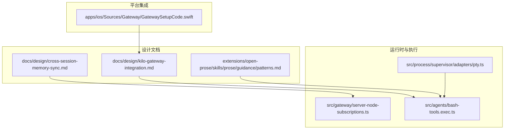
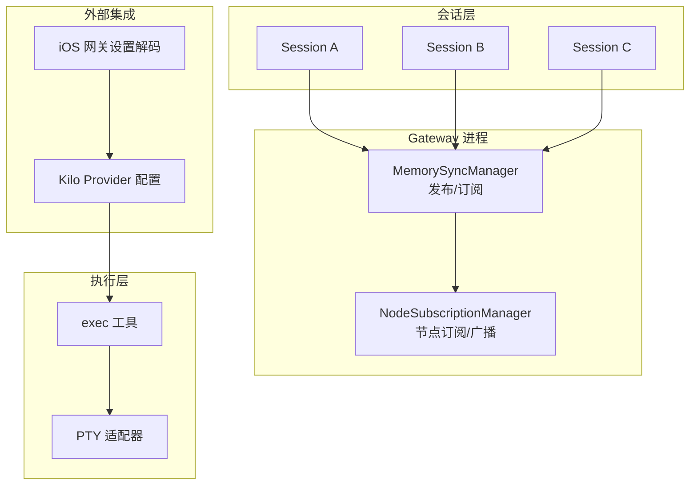
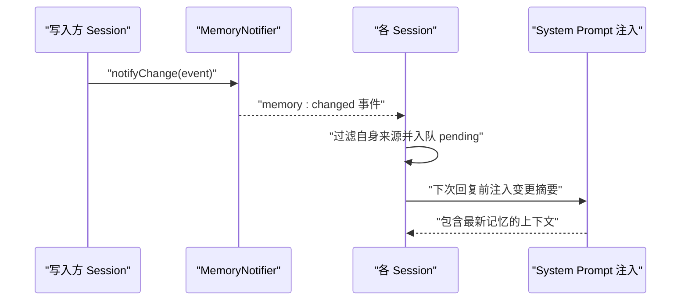
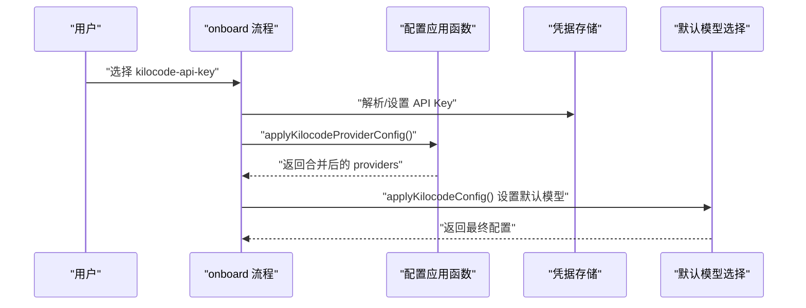
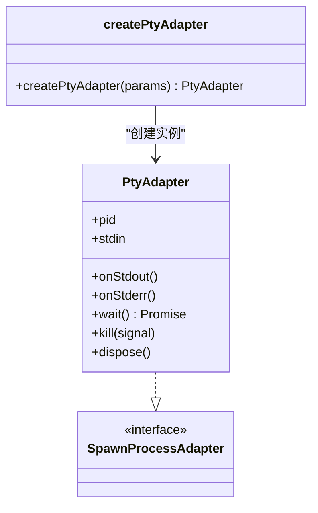
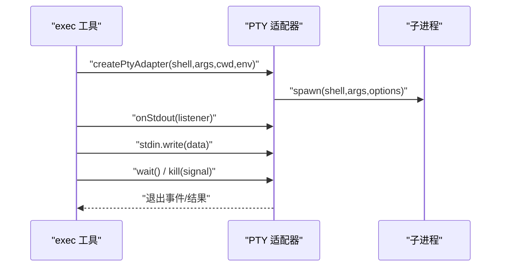
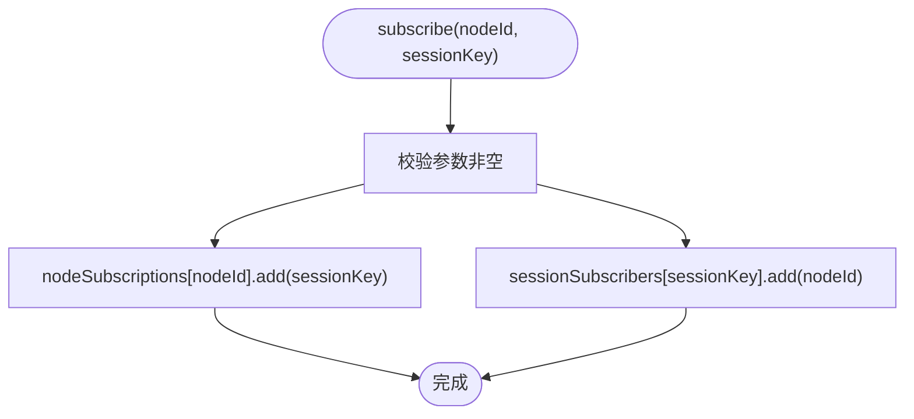
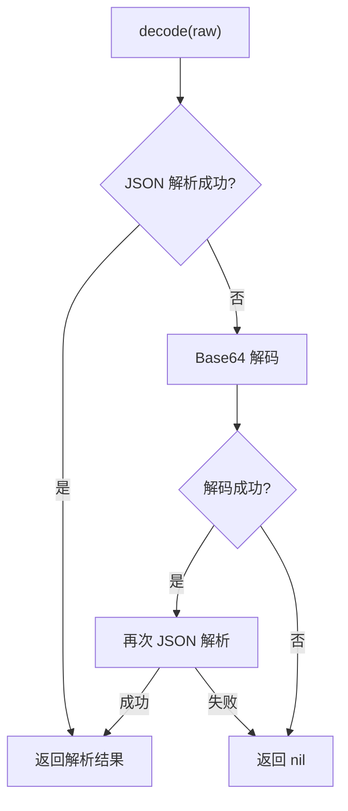
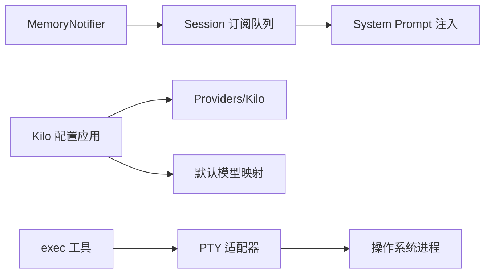

# 设计模式

<cite>
**本文引用的文件**
- [cross-session-memory-sync.md](file://docs/design/cross-session-memory-sync.md)
- [kilo-gateway-integration.md](file://docs/design/kilo-gateway-integration.md)
- [pty.ts](file://src/process/supervisor/adapters/pty.ts)
- [server-node-subscriptions.ts](file://src/gateway/server-node-subscriptions.ts)
- [bash-tools.exec.ts](file://src/agents/bash-tools.exec.ts)
- [GatewaySetupCode.swift](file://apps/ios/Sources/Gateway/GatewaySetupCode.swift)
- [pty-process-supervision.md](file://docs/experiments/pty-process-supervision.md)
- [patterns.md](file://extensions/open-prose/skills/prose/guidance/patterns.md)
</cite>

## 目录

1. [简介](#简介)
2. [项目结构](#项目结构)
3. [核心组件](#核心组件)
4. [架构总览](#架构总览)
5. [详细组件分析](#详细组件分析)
6. [依赖关系分析](#依赖关系分析)
7. [性能考量](#性能考量)
8. [故障排查指南](#故障排查指南)
9. [结论](#结论)
10. [附录](#附录)

## 简介

本文件围绕 OpenClaw 的设计模式进行系统化技术文档整理，重点覆盖以下主题：

- 跨会话内存同步机制（基于事件总线与订阅队列）
- Kilo 网关集成模式（配置应用与凭据管理）
- PTY 执行优化策略（适配器模式与进程监督）

同时，结合项目中实际出现的模式实践，如观察者模式、工厂模式、策略模式等，给出实现位置、使用场景、优缺点与性能影响分析，并总结设计决策的技术考量与权衡。

## 项目结构

OpenClaw 采用多模块分层组织，核心与运行时相关的关键目录如下：

- docs/design：设计文档与模式说明
- src/process/supervisor/adapters：进程与 PTY 适配器
- src/gateway：网关侧节点订阅与事件分发
- src/agents：代理工具与执行流程
- apps/ios：移动端网关设置解码逻辑
- extensions/open-prose：工作流与模式指导

**图表来源**

- [cross-session-memory-sync.md](file://docs/design/cross-session-memory-sync.md#L63-L90)
- [kilo-gateway-integration.md](file://docs/design/kilo-gateway-integration.md#L107-L175)
- [pty.ts](file://src/process/supervisor/adapters/pty.ts#L1-L201)
- [server-node-subscriptions.ts](file://src/gateway/server-node-subscriptions.ts#L1-L165)
- [bash-tools.exec.ts](file://src/agents/bash-tools.exec.ts#L151-L597)
- [GatewaySetupCode.swift](file://apps/ios/Sources/Gateway/GatewaySetupCode.swift#L1-L41)

**章节来源**

- [cross-session-memory-sync.md](file://docs/design/cross-session-memory-sync.md#L24-L90)
- [kilo-gateway-integration.md](file://docs/design/kilo-gateway-integration.md#L107-L175)
- [pty.ts](file://src/process/supervisor/adapters/pty.ts#L1-L201)
- [server-node-subscriptions.ts](file://src/gateway/server-node-subscriptions.ts#L1-L165)
- [bash-tools.exec.ts](file://src/agents/bash-tools.exec.ts#L151-L597)
- [GatewaySetupCode.swift](file://apps/ios/Sources/Gateway/GatewaySetupCode.swift#L1-L41)

## 核心组件

- 跨会话内存同步（事件总线 + 订阅队列）：通过进程内事件总线发布记忆变更，各会话订阅并注入到下一次回复的 system prompt。
- Kilo 网关集成（配置应用与凭据）：统一注入 Kilo 提供商配置、默认模型与凭据选择流程。
- PTY 执行优化（适配器 + 监督）：抽象 PTY 适配器接口，统一 stdout 监听、退出等待与终止策略；配合执行工具实现后台/超时控制。

**章节来源**

- [cross-session-memory-sync.md](file://docs/design/cross-session-memory-sync.md#L253-L345)
- [kilo-gateway-integration.md](file://docs/design/kilo-gateway-integration.md#L107-L175)
- [pty.ts](file://src/process/supervisor/adapters/pty.ts#L1-L201)
- [bash-tools.exec.ts](file://src/agents/bash-tools.exec.ts#L151-L597)

## 架构总览

下图展示跨会话记忆同步与 Kilo 网关集成在系统中的交互关系，以及 PTY 执行在代理工具链中的位置。

**图表来源**

- [cross-session-memory-sync.md](file://docs/design/cross-session-memory-sync.md#L63-L90)
- [server-node-subscriptions.ts](file://src/gateway/server-node-subscriptions.ts#L33-L164)
- [kilo-gateway-integration.md](file://docs/design/kilo-gateway-integration.md#L107-L175)
- [GatewaySetupCode.swift](file://apps/ios/Sources/Gateway/GatewaySetupCode.swift#L12-L41)
- [bash-tools.exec.ts](file://src/agents/bash-tools.exec.ts#L151-L597)
- [pty.ts](file://src/process/supervisor/adapters/pty.ts#L37-L200)

## 详细组件分析

### 组件一：跨会话内存同步（事件总线 + 订阅队列）

- 观察者模式：MemoryNotifier 作为事件源，Session 订阅变更事件，形成松耦合的“发布/订阅”通信。
- 订阅队列：Session 维护 pendingMemoryUpdates，在下次回复前消费并注入 system prompt。
- 一致性与实时性：通过进程内事件总线确保多会话共享同一状态视图，减少“会话间无记忆”的感知延迟。

**图表来源**

- [cross-session-memory-sync.md](file://docs/design/cross-session-memory-sync.md#L253-L345)

**章节来源**

- [cross-session-memory-sync.md](file://docs/design/cross-session-memory-sync.md#L253-L345)

### 组件二：Kilo 网关集成（配置应用与凭据）

- 工厂模式：根据用户选择与环境变量，动态生成并应用 Kilo 提供商配置与默认模型映射。
- 凭据管理：支持从 CLI、环境变量或交互输入注入 API Key，并应用到认证配置中。
- 配置合并：在现有模型提供商与默认模型基础上叠加 Kilo 的基础 URL、API 类型与别名。

**图表来源**

- [kilo-gateway-integration.md](file://docs/design/kilo-gateway-integration.md#L107-L175)
- [kilo-gateway-integration.md](file://docs/design/kilo-gateway-integration.md#L260-L336)

**章节来源**

- [kilo-gateway-integration.md](file://docs/design/kilo-gateway-integration.md#L107-L175)
- [kilo-gateway-integration.md](file://docs/design/kilo-gateway-integration.md#L260-L336)

### 组件三：PTY 执行优化（适配器 + 监督）

- 适配器模式：抽象 PTY 适配器接口，屏蔽底层 @lydell/node-pty 的差异，统一 stdin、stdout、退出等待与终止策略。
- 策略模式：kill 策略根据平台与信号类型选择不同终止路径（树杀、直接 kill、回退定时器），提升健壮性。
- 执行工具集成：exec 工具在需要 TTY 的场景启用 pty，结合后台/超时策略，实现可中断、可观测的命令执行。

**图表来源**

- [pty.ts](file://src/process/supervisor/adapters/pty.ts#L35-L200)

**图表来源**

- [pty.ts](file://src/process/supervisor/adapters/pty.ts#L37-L172)
- [bash-tools.exec.ts](file://src/agents/bash-tools.exec.ts#L465-L488)

**章节来源**

- [pty.ts](file://src/process/supervisor/adapters/pty.ts#L1-L201)
- [bash-tools.exec.ts](file://src/agents/bash-tools.exec.ts#L151-L597)
- [pty-process-supervision.md](file://docs/experiments/pty-process-supervision.md#L126-L163)

### 组件四：节点订阅与事件分发（观察者/发布订阅）

- 观察者模式：NodeSubscriptionManager 维护节点与会话的订阅关系，支持按会话或全部订阅节点广播事件。
- 数据结构：以 Map/Set 实现 O(1) 级别的订阅/取消订阅与查找。

**图表来源**

- [server-node-subscriptions.ts](file://src/gateway/server-node-subscriptions.ts#L33-L82)

**章节来源**

- [server-node-subscriptions.ts](file://src/gateway/server-node-subscriptions.ts#L1-L165)

### 组件五：移动端网关设置解码（策略/适配）

- 策略模式：优先尝试 JSON 解析，失败则 Base64 解码再解析，兼容多种输入格式。
- 安全性：对空白与非法 Base64 字符串进行容错处理，避免异常传播。

**图表来源**

- [GatewaySetupCode.swift](file://apps/ios/Sources/Gateway/GatewaySetupCode.swift#L12-L41)

**章节来源**

- [GatewaySetupCode.swift](file://apps/ios/Sources/Gateway/GatewaySetupCode.swift#L1-L41)

## 依赖关系分析

- 跨会话记忆同步依赖于 Gateway 进程内的事件总线，Session 通过订阅队列与 system prompt 注入实现“全局可见”的记忆。
- Kilo 网关集成通过配置应用函数与凭据存储，将外部提供商能力无缝接入现有模型体系。
- PTY 执行优化通过适配器与执行工具的协作，实现跨平台、可中断的终端交互式执行。

**图表来源**

- [cross-session-memory-sync.md](file://docs/design/cross-session-memory-sync.md#L253-L345)
- [kilo-gateway-integration.md](file://docs/design/kilo-gateway-integration.md#L107-L175)
- [pty.ts](file://src/process/supervisor/adapters/pty.ts#L37-L200)
- [bash-tools.exec.ts](file://src/agents/bash-tools.exec.ts#L151-L597)

**章节来源**

- [cross-session-memory-sync.md](file://docs/design/cross-session-memory-sync.md#L253-L345)
- [kilo-gateway-integration.md](file://docs/design/kilo-gateway-integration.md#L107-L175)
- [pty.ts](file://src/process/supervisor/adapters/pty.ts#L1-L201)
- [bash-tools.exec.ts](file://src/agents/bash-tools.exec.ts#L151-L597)

## 性能考量

- 观察者/事件总线：进程内事件分发开销低，适合高频变更场景；注意避免在事件回调中执行阻塞操作。
- 适配器/策略：PTY 适配器封装平台差异，kill 回退策略降低“假死”风险；合理设置超时与后台挂起窗口，平衡响应与资源占用。
- 配置应用：在启动阶段一次性应用提供商配置，避免运行期重复计算；凭据读取尽量走缓存与环境变量，减少 IO。
- 工作流模式：参考 OpenProse 指南中的并行、分层与早停策略，有助于缩短端到端耗时与降低令牌成本。

[本节为通用性能建议，不直接分析具体文件]

## 故障排查指南

- PTY 执行卡住：检查 kill 回退定时器是否触发，确认平台信号类型与终止路径；查看 stdout 监听是否正常。
- 会话记忆不同步：确认 MemoryNotifier 是否发出事件、Session 是否正确订阅且排除自身来源、system prompt 是否注入了摘要。
- Kilo 配置不生效：核对凭据存储是否写入成功、默认模型映射是否覆盖、providers 是否合并正确。
- iOS 网关设置无效：验证输入字符串是否为合法 JSON 或 Base64 编码，注意空白字符与填充长度。

**章节来源**

- [pty.ts](file://src/process/supervisor/adapters/pty.ts#L90-L172)
- [cross-session-memory-sync.md](file://docs/design/cross-session-memory-sync.md#L308-L345)
- [kilo-gateway-integration.md](file://docs/design/kilo-gateway-integration.md#L260-L336)
- [GatewaySetupCode.swift](file://apps/ios/Sources/Gateway/GatewaySetupCode.swift#L12-L41)

## 结论

通过引入事件总线、适配器与策略等设计模式，OpenClaw 在以下方面得到显著增强：

- 可扩展性：新增提供商与执行后端无需改动上层调用；订阅机制支持横向扩展。
- 可维护性：职责分离清晰，配置应用与凭据管理集中化；PTY 适配器屏蔽平台差异。
- 性能：后台/超时策略与早停/并行等模式减少无效计算与等待时间。

设计决策体现了“高内聚、低耦合”的原则，并在安全性与可靠性之间取得平衡。

[本节为总结性内容，不直接分析具体文件]

## 附录

- 相关模式与最佳实践可参考 OpenProse 指南中的并行、分层与早停等模式，有助于在工作流层面进一步优化性能与稳定性。

**章节来源**

- [patterns.md](file://extensions/open-prose/skills/prose/guidance/patterns.md#L18-L608)
