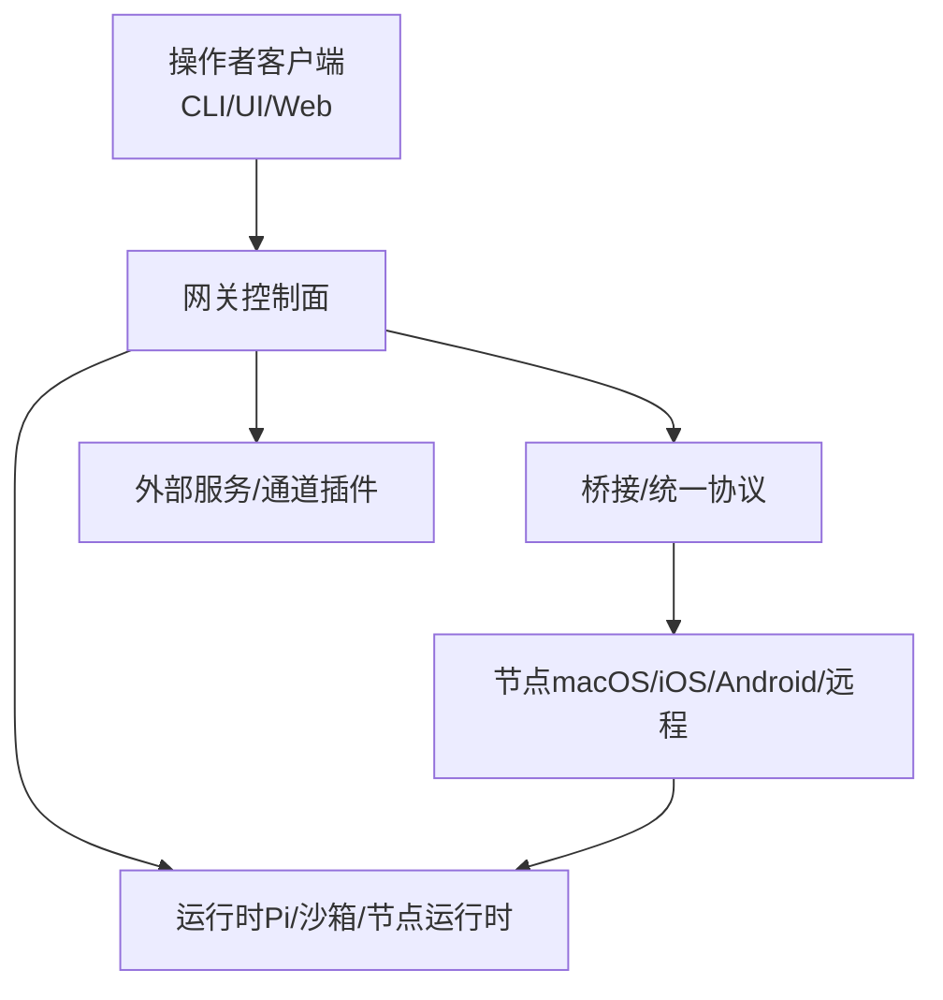
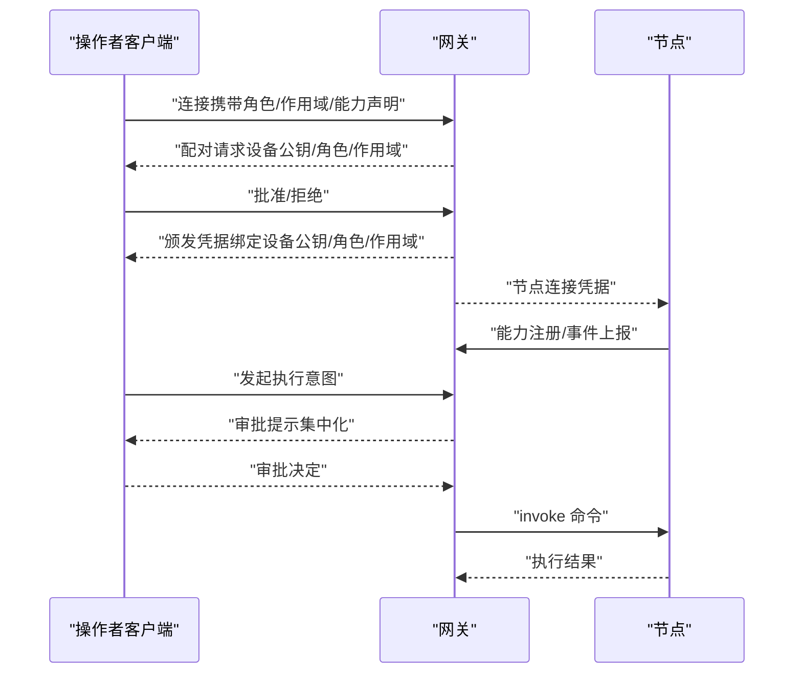
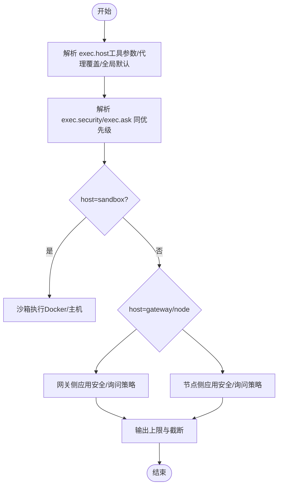
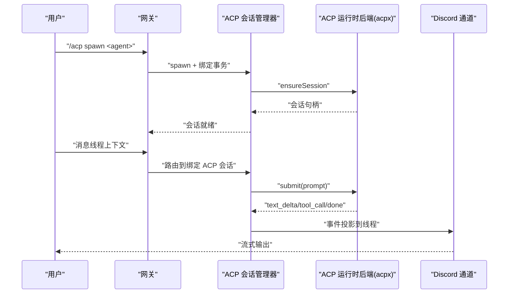
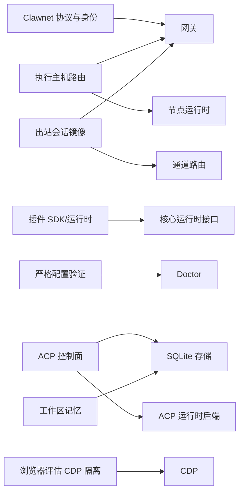

# 高级主题

<cite>
**本文引用的文件**
- [README.md](file://README.md)
- [VISION.md](file://VISION.md)
- [docs/refactor/clawnet.md](file://docs/refactor/clawnet.md)
- [docs/refactor/exec-host.md](file://docs/refactor/exec-host.md)
- [docs/refactor/outbound-session-mirroring.md](file://docs/refactor/outbound-session-mirroring.md)
- [docs/refactor/plugin-sdk.md](file://docs/refactor/plugin-sdk.md)
- [docs/refactor/strict-config.md](file://docs/refactor/strict-config.md)
- [docs/experiments/plans/acp-thread-bound-agents.md](file://docs/experiments/plans/acp-thread-bound-agents.md)
- [docs/experiments/plans/acp-unified-streaming-refactor.md](file://docs/experiments/plans/acp-unified-streaming-refactor.md)
- [docs/experiments/plans/browser-evaluate-cdp-refactor.md](file://docs/experiments/plans/browser-evaluate-cdp-refactor.md)
- [docs/experiments/research/memory.md](file://docs/experiments/research/memory.md)
- [docs/experiments/proposals/model-config.md](file://docs/experiments/proposals/model-config.md)
</cite>

## 目录

1. [引言](#引言)
2. [项目结构](#项目结构)
3. [核心组件](#核心组件)
4. [架构总览](#架构总览)
5. [详细组件分析](#详细组件分析)
6. [依赖关系分析](#依赖关系分析)
7. [性能考量](#性能考量)
8. [故障排查指南](#故障排查指南)
9. [结论](#结论)
10. [附录](#附录)

## 引言

本技术文档面向高级用户与核心贡献者，系统阐述 OpenClaw 的高级主题：重构规划、设计模式、实验性功能、架构演进、性能优化与扩展性设计，并给出基础设施、分布式与高可用方案、高级配置与自定义开发、系统集成与未来规划的实践指南。内容基于官方文档与实验性计划，帮助读者深入理解并参与系统改进。

## 项目结构

OpenClaw 是一个以 TypeScript 为主的个人 AI 助手平台，围绕“网关控制平面 + 多通道接入 + 节点执行”的架构展开。核心子系统包括：

- 网关（WebSocket 控制面）：会话、通道、模型、节点、事件与运维接口
- 通道（多平台消息渠道）：WhatsApp、Telegram、Discord、Slack、Google Chat、Signal、iMessage、BlueBubbles、Microsoft Teams、Matrix、Zalo、Zalo Personal、WebChat 等
- 节点（设备/服务节点）：macOS/iOS/Android 节点与远程节点，负责本地能力调用与媒体处理
- 工具与自动化：浏览器控制、Canvas、节点命令、定时任务、Webhook、Gmail Pub/Sub
- 运行时与安全：Pi 代理运行时、沙箱、权限与审批、类型校验与诊断工具

```mermaid
graph TB
subgraph "控制平面"
GW["网关WebSocket"]
CFG["配置与类型校验"]
DOCTOR["诊断与迁移Doctor"]
end
subgraph "通道层"
WA["WhatsApp"]
TG["Telegram"]
DC["Discord"]
SL["Slack"]
GC["Google Chat"]
SG["Signal"]
IM["iMessage/BlueBubbles"]
MT["Microsoft Teams"]
MX["Matrix"]
ZL["Zalo/Zalo Personal"]
WEB["WebChat"]
end
subgraph "节点层"
MAC["macOS 节点"]
IOS["iOS 节点"]
AND["Android 节点"]
REM["远程节点"]
end
subgraph "工具与自动化"
BR["浏览器控制"]
CV["Canvas/A2UI"]
ND["节点命令"]
CR["定时任务/唤醒"]
WH["Webhook/Gmail Pub/Sub"]
end
GW --> CFG
GW --> DOCTOR
GW --> WA
GW --> TG
GW --> DC
GW --> SL
GW --> GC
GW --> SG
GW --> IM
GW --> MT
GW --> MX
GW --> ZL
GW --> WEB
GW --> MAC
GW --> IOS
GW --> AND
GW --> REM
GW --> BR
GW --> CV
GW --> ND
GW --> CR
GW --> WH
```

章节来源

- file://README.md#L185-L239

## 核心组件

- 网关协议与身份：统一的 WebSocket 协议、角色与作用域、配对与凭据绑定、TLS 指纹与静默配对策略
- 执行主机路由：跨沙箱/网关/节点的执行策略、安全模式与审批、Unix Socket 本地 IPC
- 出站会话镜像：按目标通道会话镜像出站消息、缺失会话条目的自动创建
- 插件 SDK：统一插件 SDK 与运行时接口，约束通道连接器实现
- 严格配置验证：未知键拒绝、插件配置必须带模式、Doctor 主导迁移
- 实验性 ACP：线程绑定的 ACP 编码代理、统一流式管线、控制面持久化与幂等投递
- 浏览器评估隔离：CDP 独立执行路径，端到端预算与取消传播
- 工作区记忆：离线优先的记忆体系（Markdown 源 + 衍生索引），保留/回忆/反思循环

章节来源

- file://docs/refactor/clawnet.md#L11-L418
- file://docs/refactor/exec-host.md#L10-L317
- file://docs/refactor/outbound-session-mirroring.md#L1-L90
- file://docs/refactor/plugin-sdk.md#L1-L215
- file://docs/refactor/strict-config.md#L10-L94
- file://docs/experiments/plans/acp-thread-bound-agents.md#L1-L801
- file://docs/experiments/plans/acp-unified-streaming-refactor.md#L1-L97
- file://docs/experiments/plans/browser-evaluate-cdp-refactor.md#L1-L233
- file://docs/experiments/research/memory.md#L1-L229

## 架构总览

OpenClaw 的架构强调“控制面集中、执行面分散、通道与节点解耦、运行时可插拔”。控制面通过网关统一编排，通道与节点通过桥接或统一协议交互；工具与自动化通过插件 SDK 与运行时注入，既保证一致性又便于扩展。

图表来源

- [docs/refactor/clawnet.md](file://docs/refactor/clawnet.md#L111-L142)
- [docs/refactor/exec-host.md](file://docs/refactor/exec-host.md#L40-L75)
- [docs/refactor/plugin-sdk.md](file://docs/refactor/plugin-sdk.md#L19-L44)

章节来源

- file://docs/refactor/clawnet.md#L111-L142
- file://docs/refactor/exec-host.md#L40-L75
- file://docs/refactor/plugin-sdk.md#L19-L44

## 详细组件分析

### 组件一：Clawnet 协议与身份（统一网络协议与角色）

- 目标：一套协议、两类角色（节点/操作者）、统一认证与配对、TLS 指纹、集中审批、稳定设备 ID 与人类标签
- 关键点：
  - 角色与作用域：operator.read/write/admin、node
  - 审批集中化：由网关托管，广播到所有操作者 UI，首个决议生效
  - 设备绑定认证：设备密钥对 + 基于公钥指纹的设备 ID，支持 mTLS 或短命令牌
  - TLS 全链路：复用桥接 TLS 运行时，发现 TXT 广播指纹
  - 迁移阶段：先在 WS 中增加角色/作用域，再逐步替换桥接、统一审批与 TLS

图表来源

- [docs/refactor/clawnet.md](file://docs/refactor/clawnet.md#L155-L247)

章节来源

- file://docs/refactor/clawnet.md#L15-L418

### 组件二：执行主机路由与审批（跨主机执行与安全）

- 目标：将执行路由到沙箱、网关或节点，提供 per-agent 策略、允许列表、询问模式与节点绑定
- 关键点：
  - 主机：sandbox/gateway/node
  - 安全模式：deny/allowlist/full
  - 询问模式：off/on-miss/always
  - 审批存储：本地 JSON，含默认策略、每 Agent 允许列表与 IPC 令牌
  - 跑步服务：无头系统服务，macOS 应用通过 Unix Socket + 令牌进行本地 IPC
  - 输出上限：合并 stdout/stderr，截断并标注

图表来源

- [docs/refactor/exec-host.md](file://docs/refactor/exec-host.md#L62-L98)

章节来源

- file://docs/refactor/exec-host.md#L10-L317

### 组件三：出站会话镜像（按目标通道会话镜像）

- 目标：出站消息镜像到目标通道会话，保持线程/话题一致性，缺失会话条目自动创建
- 关键点：
  - 会话键派生：使用构建器与身份链接（dmScope/identityLinks）
  - 插件路径：通过统一入口镜像到目标会话
  - 线程/话题映射：Slack/Discord/Telegram 等差异化处理
  - 大小写规范化：会话键统一小写

章节来源

- file://docs/refactor/outbound-session-mirroring.md#L1-L90

### 组件四：插件 SDK 与运行时（统一通道连接器）

- 目标：所有通道连接器作为插件，使用统一 SDK 与运行时接口，禁止直接导入核心源码
- 关键点：
  - SDK：类型、配置辅助、配对与引导助手、工具参数读取
  - 运行时：文本分块、回复调度、路由、配对、媒体拉取/保存、提及匹配、群组策略、防抖、命令授权
  - 迁移路线：先脚手架，再桥接清理，再到重度直接导入插件，最后强制约束

章节来源

- file://docs/refactor/plugin-sdk.md#L1-L215

### 组件五：严格配置验证与 Doctor 迁移

- 目标：拒绝未知键、插件必须带模式、启动时 Dry-Run Doctor、无效配置仅允许诊断命令
- 关键点：
  - 严格对象验证，根与嵌套均不允许未知键
  - 插件清单与模式强制，缺失或非法阻止加载
  - Doctor 自动运行并提供修复建议

章节来源

- file://docs/refactor/strict-config.md#L10-L94

### 组件六：ACP 线程绑定代理（实验性）

- 目标：在支持线程的通道中（Discord 首个适配器）提供生产级生命周期与恢复
- 关键点：
  - 控制面：会话元数据、线程绑定、交付不变量与重复抑制、生命周期清理与恢复
  - 运行时后端：可插拔（acpx 首个后端），负责传输、队列、取消、重连
  - 控制面数据模型：SQLite（WAL）持久化，事件追加，投递检查点，幂等键
  - 统一流式管线：统一事件契约、共享组装器、通道投影器、投递账本与重放
  - 路由与交付：入站线程绑定优先，出站事件投影到绑定线程，避免父通道重复输出

图表来源

- [docs/experiments/plans/acp-thread-bound-agents.md](file://docs/experiments/plans/acp-thread-bound-agents.md#L105-L185)

章节来源

- file://docs/experiments/plans/acp-thread-bound-agents.md#L1-L801
- file://docs/experiments/plans/acp-unified-streaming-refactor.md#L1-L97

### 组件七：浏览器评估 CDP 隔离（实验性）

- 目标：将 act:evaluate 从 Playwright 页面命令队列中隔离，避免阻塞后续动作；端到端超时预算一致
- 关键点：
  - 单一预算概念：从调用方到处理器再到页面内执行，统一超时与取消传播
  - CDP 独立执行：独立 WebSocket + CDP 会话，支持 Runtime.evaluate 与 DOM.resolveNode + Runtime.callFunctionOn
  - 参考元数据：在快照时补充 backendDOMNodeId，支持元素定位的 CDP 路径
  - 最后手段恢复：TerminateExecution + 断开 Playwright

章节来源

- file://docs/experiments/plans/browser-evaluate-cdp-refactor.md#L1-L233

### 组件八：工作区记忆（研究与探索）

- 目标：离线优先的记忆体系，以 Markdown 为源，衍生索引提供检索与反思
- 关键点：
  - 源：每日日志、稳定文件（memory.md、SOUL.md 等）
  - 派生：SQLite（FTS5 + 可选向量）索引，可重建
  - 循环：Retain（叙事事实）、Recall（检索与溯源）、Reflect（实体/观点总结与信心更新）
  - 集成：OpenClaw 内置 CLI 与库分离，便于测试与复用

章节来源

- file://docs/experiments/research/memory.md#L1-L229

### 组件九：模型配置探索（提案）

- 目标：多提供商多认证配置、简单选择与可预测回退、文本/图像能力分离
- 关键点：
  - provider/model 与别名
  - 提供商内多认证配置顺序
  - 全局回退列表
  - 图像路由仅在显式配置时覆盖

章节来源

- file://docs/experiments/proposals/model-config.md#L1-L37

## 依赖关系分析

- 协议与身份（Clawnet）依赖网关控制面与节点桥接/统一协议
- 执行主机路由依赖网关策略、节点运行时与本地 IPC
- 出站会话镜像依赖通道路由与会话键派生
- 插件 SDK 与运行时依赖核心运行时接口，约束通道连接器
- 严格配置验证依赖 Doctor 与核心配置模块
- ACP 控制面依赖 SQLite 存储、运行时后端注册与通道投影
- 浏览器评估 CDP 隔离依赖 CDP 与 Playwright 的协同
- 工作区记忆依赖 SQLite 与检索工具

图表来源

- [docs/refactor/clawnet.md](file://docs/refactor/clawnet.md#L111-L142)
- [docs/refactor/exec-host.md](file://docs/refactor/exec-host.md#L151-L195)
- [docs/refactor/outbound-session-mirroring.md](file://docs/refactor/outbound-session-mirroring.md#L29-L45)
- [docs/refactor/plugin-sdk.md](file://docs/refactor/plugin-sdk.md#L19-L44)
- [docs/refactor/strict-config.md](file://docs/refactor/strict-config.md#L46-L68)
- [docs/experiments/plans/acp-thread-bound-agents.md](file://docs/experiments/plans/acp-thread-bound-agents.md#L375-L430)
- [docs/experiments/plans/browser-evaluate-cdp-refactor.md](file://docs/experiments/plans/browser-evaluate-cdp-refactor.md#L72-L95)
- [docs/experiments/research/memory.md](file://docs/experiments/research/memory.md#L87-L102)

章节来源

- file://docs/refactor/clawnet.md#L111-L142
- file://docs/refactor/exec-host.md#L151-L195
- file://docs/refactor/outbound-session-mirroring.md#L29-L45
- file://docs/refactor/plugin-sdk.md#L19-L44
- file://docs/refactor/strict-config.md#L46-L68
- file://docs/experiments/plans/acp-thread-bound-agents.md#L375-L430
- file://docs/experiments/plans/browser-evaluate-cdp-refactor.md#L72-L95
- file://docs/experiments/research/memory.md#L87-L102

## 性能考量

- 流式与投递一致性：统一流式管线减少重复实现，降低格式化与投递不一致导致的额外往返
- 执行隔离：CDP 独立执行避免页面命令队列阻塞，提升吞吐与稳定性
- 会话镜像：按目标会话镜像减少错误会话查找与重复投递
- 配置验证：严格模式减少运行期不确定性，降低因配置漂移引发的性能波动
- 存储与检索：SQLite FTS5 提供轻量检索，向量仅在规模与质量需求驱动下启用

## 故障排查指南

- 配置问题：运行 Doctor 干跑与修复，确保未知键与插件模式被清除与修正
- 执行失败：检查 exec.host/exec.security/exec.ask 与节点绑定，确认审批存储与 IPC 令牌
- 线程绑定 ACP：核对绑定状态、会话生命周期与幂等键，避免重复输出与丢失
- 浏览器评估：若卡住，确认 CDP 路径是否可用，必要时回退 Playwright 并观察终止执行记录
- 记忆检索：确认索引重建流程与 FTS5/向量索引状态

章节来源

- file://docs/refactor/strict-config.md#L46-L68
- file://docs/refactor/exec-host.md#L298-L317
- file://docs/experiments/plans/acp-thread-bound-agents.md#L554-L575
- file://docs/experiments/plans/browser-evaluate-cdp-refactor.md#L138-L147
- file://docs/experiments/research/memory.md#L87-L102

## 结论

OpenClaw 的高级主题聚焦于“协议统一、执行隔离、通道解耦、运行时可插拔、控制面持久化与幂等投递”。通过 Clawnet、执行主机路由、出站会话镜像、插件 SDK、严格配置验证、ACP 控制面与流式管线、浏览器评估 CDP 隔离以及工作区记忆研究，系统在安全性、可维护性、可扩展性与用户体验之间取得平衡。建议在生产落地前完成 Doctor 干跑与修复、逐步迁移桥接协议、完善运行时后端与通道投影、强化可观测性与 SLO。

## 附录

- 开发与贡献：遵循最小 PR、避免大体积 PR、保持变更聚焦；参考贡献指南与安全政策
- 安全与合规：强默认安全、明确风险开关、暴露可控高功率工作流
- 未来方向：多提供商模型支持、通道与平台增强、性能与测试基础设施、计算机使用与代理能力、跨平台体验一致性、配套应用生态

章节来源

- file://VISION.md#L34-L111
- file://README.md#L415-L432
