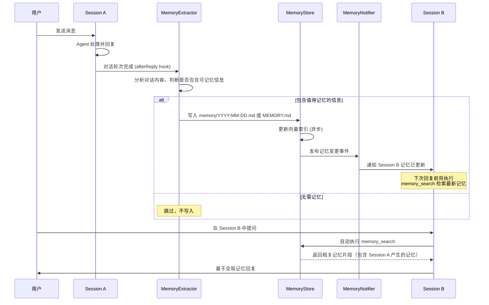

# 跨会话全局记忆自动同步机制 — 设计方案

> **版本**: v1.0
> **日期**: 2026-02-09
> **状态**: 草案

---

## 1. 背景与问题

### 1.1 当前记忆架构

OpenClaw 现有一套基于文件的 Agent 级记忆系统：

| 组件                     | 文件/路径                                                 | 作用                                        | 触发方式                       |
| ------------------------ | --------------------------------------------------------- | ------------------------------------------- | ------------------------------ |
| **MEMORY.md**            | `~/.openclaw/workspace/MEMORY.md`                         | 长期策展记忆（偏好、决策、事实）            | 模型主动写入                   |
| **memory/YYYY-MM-DD.md** | `~/.openclaw/workspace/memory/*.md`                       | 每日日志（追加模式）                        | 模型主动写入                   |
| **Session Memory Hook**  | `src/hooks/bundled/session-memory/handler.ts`             | `/new` 命令时保存旧会话                     | `/new` 命令触发                |
| **Memory Flush**         | `src/auto-reply/reply/memory-flush.ts`                    | 上下文压缩前提醒模型保存记忆                | 接近 compaction 阈值时自动触发 |
| **memory_search 工具**   | `src/agents/tools/memory-tool.ts`                         | 语义搜索 MEMORY.md + memory/\*.md           | 模型主动调用                   |
| **Bootstrap 加载**       | `src/agents/workspace.ts` → `loadWorkspaceBootstrapFiles` | 新会话启动时注入 MEMORY.md 到 system prompt | 会话初始化时                   |

### 1.2 核心问题

当前系统存在以下关键不足，导致用户感知上"跨会话没有记忆"：

```
┌─────────────────────────────────────────────────────────────────┐
│  问题 1: 记忆写入完全依赖模型主动执行                               │
│  → 模型不一定每次都会将重要信息写入 MEMORY.md 或 memory/*.md          │
│  → 用户说"记住这个"时模型可能只放在对话上下文中而未持久化              │
├─────────────────────────────────────────────────────────────────┤
│  问题 2: MEMORY.md 只在会话创建时加载一次                           │
│  → 会话 A 写入 MEMORY.md 后，已打开的会话 B 不会感知到变化            │
│  → 必须新建或重启会话 B 才能读取到最新记忆                           │
├─────────────────────────────────────────────────────────────────┤
│  问题 3: Session Memory Hook 仅在 /new 时触发                     │
│  → 用户直接切换会话或关闭窗口时，旧会话内容不会被保存                  │
│  → 只有主动使用 /new 命令才能触发记忆持久化                          │
├─────────────────────────────────────────────────────────────────┤
│  问题 4: memory_search 不被一致使用                                │
│  → System prompt 中虽有"Mandatory recall step"提示                │
│  → 但模型并非每次对话开头都执行 memory_search                       │
└─────────────────────────────────────────────────────────────────┘
```

### 1.3 目标

设计并实现一套**跨会话全局记忆自动同步机制**，使得：

1. **自动提取**：每轮对话结束后，系统自动从对话中提取值得记忆的信息
2. **实时同步**：一个会话中产生的记忆能被其他活跃会话感知
3. **主动召回**：新会话/已有会话在回复前能主动检索相关的全局记忆
4. **无感体验**：整个过程对用户透明，不需要用户主动说"记住"

---

## 2. 整体架构设计

### 2.1 架构概览

```
┌──────────────────────────────────────────────────────────────────────────┐
│                         OpenClaw Gateway 进程                            │
│                                                                          │
│  ┌─────────────┐    ┌─────────────┐    ┌─────────────┐                  │
│  │  Session A   │    │  Session B   │    │  Session C   │                 │
│  │  (活跃对话)   │    │  (活跃对话)   │    │  (活跃对话)   │                 │
│  └──────┬───────┘    └──────┬───────┘    └──────┬───────┘                │
│         │                   │                   │                        │
│         ▼                   ▼                   ▼                        │
│  ┌──────────────────────────────────────────────────────────────┐        │
│  │                 MemorySyncManager (新增)                      │        │
│  │                                                              │        │
│  │  ┌──────────────────┐  ┌──────────────────┐                  │        │
│  │  │ ① 记忆提取器      │  │ ② 记忆变更通知器   │                  │        │
│  │  │ (MemoryExtractor) │  │ (MemoryNotifier)  │                  │        │
│  │  └────────┬─────────┘  └────────┬─────────┘                  │        │
│  │           │                     │                             │        │
│  │           ▼                     ▼                             │        │
│  │  ┌──────────────────────────────────────────┐                │        │
│  │  │  ③ 记忆存储层 (MemoryStore)               │                │        │
│  │  │  - MEMORY.md (长期策展)                    │                │        │
│  │  │  - memory/YYYY-MM-DD.md (每日日志)         │                │        │
│  │  │  - memory-index.sqlite (向量索引)          │                │        │
│  │  └──────────────────────────────────────────┘                │        │
│  └──────────────────────────────────────────────────────────────┘        │
│                                                                          │
└──────────────────────────────────────────────────────────────────────────┘
```

### 2.2 核心流程



---

## 3. 模块详细设计

### 3.1 模块一：记忆自动提取器 (MemoryExtractor)

#### 3.1.1 职责

在每轮对话结束后，**自动**分析对话内容并提取值得持久化的信息，而不依赖模型主动写入。

#### 3.1.2 触发时机

利用现有 Hook 系统，注册新的事件类型 `agent:afterReply`：

```typescript
// src/hooks/bundled/memory-extract/handler.ts

import type { HookHandler } from "../../hooks.js";

/**
 * 在 agent 回复完成后自动触发记忆提取
 *
 * 触发条件:
 *   - event.type === "agent"
 *   - event.action === "afterReply"
 *   - event.context 中包含本轮对话的 user message 和 assistant reply
 */
const extractMemoryAfterReply: HookHandler = async (event) => {
  if (event.type !== "agent" || event.action !== "afterReply") {
    return;
  }
  // ... 提取逻辑
};
```

#### 3.1.3 提取策略

采用**轻量级 LLM 评估 + 规则过滤**的混合策略：

```
┌──────────────────────────────────────────────────────────────────┐
│                      记忆提取流水线                                │
│                                                                  │
│  Step 1: 规则预过滤 (快速，无 LLM 调用)                            │
│  ├─ 排除: 纯问候/闲聊、太短的对话 (<50 字)                         │
│  ├─ 排除: 纯代码执行/工具调用输出                                   │
│  ├─ 优先: 包含"记住"/"以后"/"偏好"/"总是"/"不要"等关键词              │
│  └─ 优先: 包含决策性内容 (选择了X方案、确认了Y做法)                   │
│                                                                  │
│  Step 2: LLM 轻量评估 (仅对通过预过滤的内容)                        │
│  ├─ 使用小模型 (如 gpt-4o-mini / gemini-flash)                    │
│  ├─ Prompt: "从以下对话中提取值得长期记忆的信息"                     │
│  ├─ 输出格式: JSON { shouldStore: bool, entries: [...] }           │
│  └─ 每个 entry: { category, content, importance }                 │
│                                                                  │
│  Step 3: 去重与合并                                                │
│  ├─ 与现有 MEMORY.md 内容做语义比对                                 │
│  ├─ 避免重复写入已知信息                                            │
│  └─ 合并相似条目，更新过期信息                                      │
│                                                                  │
│  Step 4: 写入存储                                                  │
│  ├─ 高重要性 → MEMORY.md (长期记忆)                                │
│  └─ 普通重要性 → memory/YYYY-MM-DD.md (每日日志)                   │
└──────────────────────────────────────────────────────────────────┘
```

#### 3.1.4 配置接口

```json5
// openclaw.config.json5
{
  agents: {
    defaults: {
      memorySync: {
        // 是否启用自动记忆提取
        autoExtract: {
          enabled: true,
          // 使用的提取模型 (建议小模型降低成本)
          model: "gpt-4o-mini",
          // 最小对话长度 (字符数)，低于此值不触发提取
          minConversationLength: 50,
          // 最大每日提取次数 (防止过度消耗 API)
          maxDailyExtractions: 100,
          // 提取的防抖间隔 (秒)，避免频繁触发
          debounceSeconds: 30,
          // 需要排除提取的会话类型
          excludeSessionTypes: ["group"],
        },
      },
    },
  },
}
```

#### 3.1.5 提取 Prompt 设计

```typescript
const EXTRACTION_SYSTEM_PROMPT = `你是一个记忆提取助手。分析以下对话，提取值得长期记忆的信息。

提取标准:
1. 用户偏好 (编程语言/框架/风格/习惯)
2. 明确的决策或选择
3. 用户明确要求记住的内容
4. 重要的项目事实 (架构决策、技术栈、部署信息)
5. 用户个人信息 (名称、角色、团队)

不要提取:
1. 临时性的 debug 过程
2. 纯代码片段
3. 一次性的操作指令
4. 通用知识

返回 JSON:
{
  "shouldStore": true/false,
  "entries": [
    {
      "category": "preference|decision|fact|instruction",
      "content": "提取的记忆内容",
      "importance": "high|normal",
      "target": "MEMORY.md|daily"
    }
  ]
}`;
```

---

### 3.2 模块二：记忆变更通知器 (MemoryNotifier)

#### 3.2.1 职责

当记忆文件发生变更时，通知所有活跃会话，使其在下次回复前能感知到最新的全局记忆。

#### 3.2.2 设计方案

采用**进程内事件总线 (EventEmitter)** 模式，因为所有 Session 共享同一个 Gateway 进程：

```typescript
// src/memory/memory-notifier.ts

import { EventEmitter } from "node:events";

export type MemoryChangeEvent = {
  /** 变更来源的会话 key */
  sourceSessionKey: string;
  /** 变更的文件路径 */
  changedFiles: string[];
  /** 变更时间戳 */
  timestamp: number;
  /** 变更摘要 (可选，用于快速注入) */
  summary?: string;
};

class MemoryNotifier extends EventEmitter {
  private static instance: MemoryNotifier;

  static getInstance(): MemoryNotifier {
    if (!MemoryNotifier.instance) {
      MemoryNotifier.instance = new MemoryNotifier();
    }
    return MemoryNotifier.instance;
  }

  /** 发布记忆变更事件 */
  notifyChange(event: MemoryChangeEvent): void {
    this.emit("memory:changed", event);
  }

  /** 订阅记忆变更事件 */
  onMemoryChanged(handler: (event: MemoryChangeEvent) => void): void {
    this.on("memory:changed", handler);
  }

  /** 取消订阅 */
  offMemoryChanged(handler: (event: MemoryChangeEvent) => void): void {
    this.off("memory:changed", handler);
  }
}

export const memoryNotifier = MemoryNotifier.getInstance();
```

#### 3.2.3 Session 端订阅机制

每个 Session 在初始化时订阅记忆变更事件，并维护一个 `pendingMemoryUpdates` 队列：

```typescript
// 伪代码: 在 session 初始化时
memoryNotifier.onMemoryChanged((event) => {
  // 排除自身产生的变更
  if (event.sourceSessionKey === currentSessionKey) return;

  // 将变更加入待处理队列
  sessionState.pendingMemoryUpdates.push({
    summary: event.summary,
    timestamp: event.timestamp,
  });
});
```

#### 3.2.4 通知消费方式

Session 在下次准备回复时，检查 `pendingMemoryUpdates` 队列并注入到 system prompt：

```
┌──────────────────────────────────────────────────────────────────┐
│  Session B 收到用户新消息时:                                       │
│                                                                  │
│  1. 检查 pendingMemoryUpdates 队列                                │
│  2. 如果有待处理的更新:                                            │
│     a. 在 system prompt 末尾追加:                                  │
│        "[Memory Update] 其他会话在 {时间} 新增了以下记忆:           │
│         - {记忆摘要1}                                             │
│         - {记忆摘要2}                                             │
│         请在回复时考虑这些最新信息。                                 │
│         使用 memory_search 获取完整详情。"                          │
│     b. 清空已消费的更新                                            │
│  3. 正常处理用户消息并回复                                         │
└──────────────────────────────────────────────────────────────────┘
```

---

### 3.3 模块三：增强的 Bootstrap 记忆加载

#### 3.3.1 现状

当前 `loadWorkspaceBootstrapFiles`（`src/agents/workspace.ts` 第237行）在新会话创建时一次性加载 `MEMORY.md` 的**全文**到 system prompt。问题是：

- 如果 MEMORY.md 很长，会占用大量 context window
- 已有会话不会重新加载更新后的 MEMORY.md

#### 3.3.2 改进方案

```
┌──────────────────────────────────────────────────────────────────┐
│  新的 Bootstrap 记忆加载策略:                                      │
│                                                                  │
│  A. 新会话创建时:                                                  │
│     1. 加载 MEMORY.md 全文 (保持现有行为)                           │
│     2. 加载最近 3 天的 memory/YYYY-MM-DD.md 摘要                   │
│     3. 执行一次 memory_search("session context") 预热             │
│                                                                  │
│  B. 已有会话接收新消息时:                                           │
│     1. 检查 MEMORY.md 的 mtime 是否有变化                          │
│     2. 如果有变化，将 diff 以增量方式注入 system prompt              │
│     3. 消费 pendingMemoryUpdates 队列                              │
└──────────────────────────────────────────────────────────────────┘
```

#### 3.3.3 MEMORY.md 增量同步

```typescript
// src/memory/memory-bootstrap-sync.ts

import fs from "node:fs/promises";
import crypto from "node:crypto";

type MemoryFileState = {
  path: string;
  hash: string; // 文件内容 hash
  mtime: number; // 最后修改时间
  content: string; // 上次加载的内容
};

/**
 * 追踪 MEMORY.md 的变化，返回增量内容
 */
export async function detectMemoryChanges(
  state: MemoryFileState,
): Promise<{ changed: boolean; diff: string | null; newState: MemoryFileState }> {
  const currentContent = await fs.readFile(state.path, "utf-8");
  const currentHash = crypto.createHash("md5").update(currentContent).digest("hex");

  if (currentHash === state.hash) {
    return { changed: false, diff: null, newState: state };
  }

  // 计算新增的内容行
  const oldLines = new Set(state.content.split("\n"));
  const newLines = currentContent.split("\n").filter((line) => !oldLines.has(line));
  const diff = newLines.length > 0 ? newLines.join("\n") : null;

  return {
    changed: true,
    diff,
    newState: {
      path: state.path,
      hash: currentHash,
      mtime: Date.now(),
      content: currentContent,
    },
  };
}
```

---

### 3.4 模块四：强化的 memory_search 使用策略

#### 3.4.1 现状

当前 system prompt 中 `buildMemorySection` 函数（`src/agents/system-prompt.ts` 第40行）生成的提示如下：

```
## Memory Recall
Before answering anything about prior work, decisions, dates, people,
preferences, or todos: run memory_search on MEMORY.md + memory/*.md;
then use memory_get to pull only the needed lines.
```

问题：模型有时会跳过 `memory_search` 直接回答。

#### 3.4.2 改进方案：自动预搜索 (Auto Pre-Search)

在 Agent 执行流程中，增加一个**自动预搜索步骤**，不依赖模型自主决策：

```
┌──────────────────────────────────────────────────────────────────┐
│  Agent 收到用户消息后的处理流程 (改进后):                            │
│                                                                  │
│  Step 0: [新增] 自动记忆预搜索                                     │
│  ├─ 提取用户消息中的关键词                                          │
│  ├─ 执行 memory_search(用户消息关键词)                             │
│  ├─ 如果有相关结果 (score > threshold):                            │
│  │   → 将结果注入到本轮的 system prompt 补充中                      │
│  │   → 格式: "[Relevant Memory] ..."                              │
│  └─ 耗时限制: 最多 2 秒，超时则跳过                                 │
│                                                                  │
│  Step 1: 构建完整 prompt (包含预搜索结果)                           │
│  Step 2: 调用 LLM 生成回复                                         │
│  Step 3: [新增] 触发记忆提取 (afterReply hook)                     │
└──────────────────────────────────────────────────────────────────┘
```

#### 3.4.3 配置接口

```json5
{
  agents: {
    defaults: {
      memorySync: {
        autoRecall: {
          enabled: true,
          // 预搜索的超时时间 (ms)
          timeoutMs: 2000,
          // 最少匹配分数
          minScore: 0.5,
          // 最多注入的结果条数
          maxResults: 3,
          // 注入结果的最大 token 数
          maxInjectedTokens: 500,
        },
      },
    },
  },
}
```

---

## 4. 数据流全景图

```mermaid
graph TB
    subgraph "Session A"
        UA[用户消息] --> PA[Agent 处理]
        PA --> RA[Agent 回复]
        RA --> AH[afterReply Hook]
    end

    subgraph "MemorySyncManager"
        AH --> RF[规则预过滤]
        RF -->|通过| LE[LLM 评估提取]
        RF -->|不通过| SKIP[跳过]
        LE --> DD[去重与合并]
        DD --> WR[写入存储]
    end

    subgraph "MemoryStore"
        WR --> MD[MEMORY.md]
        WR --> DL[memory/YYYY-MM-DD.md]
        MD --> VI[向量索引更新]
        DL --> VI
    end

    subgraph "MemoryNotifier"
        WR --> NC[发布变更通知]
        NC --> EQ[各 Session 的事件队列]
    end

    subgraph "Session B"
        UB[用户消息] --> PS[自动预搜索]
        EQ --> PS
        PS --> VI
        VI -->|搜索结果| INJ[注入 system prompt]
        INJ --> PB[Agent 处理]
        PB --> RB[Agent 回复]
    end

    style MD fill:#2d5a27,stroke:#4caf50
    style DL fill:#2d5a27,stroke:#4caf50
    style VI fill:#1a3a5c,stroke:#2196f3
    style NC fill:#5a2d27,stroke:#f44336
```



---

## 5. 新增文件清单

```
src/
├── memory/
│   ├── memory-notifier.ts          # 记忆变更事件通知器
│   ├── memory-bootstrap-sync.ts    # MEMORY.md 增量同步检测
│   └── memory-auto-recall.ts       # 自动预搜索逻辑
│
├── hooks/
│   └── bundled/
│       └── memory-extract/
│           ├── handler.ts          # afterReply hook: 自动记忆提取
│           ├── extractor.ts        # LLM 记忆提取核心逻辑
│           ├── rules.ts            # 规则预过滤器
│           └── dedup.ts            # 去重与合并
│
├── auto-reply/
│   └── reply/
│       └── agent-runner-memory-sync.ts  # 在 agent runner 中集成记忆同步
│
└── config/
    └── types.memory-sync.ts        # 新增配置类型定义
```

---

## 6. 需修改的现有文件

| 文件                                   | 修改内容                                                    |
| -------------------------------------- | ----------------------------------------------------------- |
| `src/hooks/internal-hooks.ts`          | 新增 `agent:afterReply` 事件类型                            |
| `src/auto-reply/reply/agent-runner.ts` | 在 agent 回复完成后触发 `afterReply` hook                   |
| `src/agents/system-prompt.ts`          | 增强 `buildMemorySection`，支持注入预搜索结果和记忆更新通知 |
| `src/agents/workspace.ts`              | 增加 MEMORY.md 增量同步追踪                                 |
| `src/agents/tools/memory-tool.ts`      | `memory_search` 结果缓存（减少重复搜索）                    |
| `src/config/config.ts`                 | 新增 `memorySync` 配置字段                                  |
| `src/auto-reply/reply/session.ts`      | 在 session 初始化时订阅 MemoryNotifier                      |

---

## 7. 实现分期计划

### Phase 1: 记忆变更通知 + 增量同步 (基础设施)

**预计工作量**: 3-5 天

- [ ] 实现 `MemoryNotifier` 单例
- [ ] 实现 `MemoryFileState` 追踪 MEMORY.md 变化
- [ ] 在 session 初始化时订阅变更事件
- [ ] 在 system prompt 构建时消费 `pendingMemoryUpdates`
- [ ] 在现有的文件写入工具 (write/edit) 写入 workspace 下 memory 文件时发布变更通知

### Phase 2: 自动预搜索 (Auto Pre-Search)

**预计工作量**: 2-3 天

- [ ] 实现 `memoryAutoRecall` 模块
- [ ] 在 `agent-runner.ts` 的消息处理流程中集成预搜索步骤
- [ ] 将预搜索结果注入 system prompt 补充区域
- [ ] 添加超时控制和配置接口
- [ ] 编写单元测试

### Phase 3: 自动记忆提取 (Memory Extractor)

**预计工作量**: 5-7 天

- [ ] 新增 `agent:afterReply` hook 事件
- [ ] 在 `agent-runner.ts` 中触发 afterReply hook
- [ ] 实现规则预过滤器 (`rules.ts`)
- [ ] 实现 LLM 记忆提取器 (`extractor.ts`)
- [ ] 实现去重与合并逻辑 (`dedup.ts`)
- [ ] 实现 hook handler 完整流程
- [ ] 添加配置接口 (`memorySync.autoExtract`)
- [ ] 编写集成测试

### Phase 4: 优化与监控

**预计工作量**: 2-3 天

- [ ] 添加记忆同步的 metrics 统计
- [ ] 优化 LLM 提取 prompt（基于实际使用反馈）
- [ ] 添加 `/memory status` 命令查看记忆同步状态
- [ ] 文档更新

---

## 8. 性能与成本考量

### 8.1 LLM 调用成本

| 场景     | 模型              | 估算 Token/次 | 频率     | 日均成本 (GPT-4o-mini) |
| -------- | ----------------- | ------------- | -------- | ---------------------- |
| 记忆提取 | gpt-4o-mini       | ~800          | ~50次/天 | ~$0.01                 |
| 去重比对 | gpt-4o-mini       | ~400          | ~20次/天 | ~$0.003                |
| 预搜索   | 无 LLM (向量搜索) | 0             | 每条消息 | $0                     |
| **总计** |                   |               |          | **~$0.013/天**         |

### 8.2 延迟影响

| 操作                  | 延迟     | 是否阻塞用户          |
| --------------------- | -------- | --------------------- |
| 记忆提取 (afterReply) | 1-3秒    | ❌ 异步，不阻塞       |
| 预搜索 (autoRecall)   | 50-200ms | ⚠️ 略微增加首响应时间 |
| 变更通知              | <1ms     | ❌ 进程内事件         |
| 增量同步检测          | <5ms     | ❌ 仅 stat + hash     |

### 8.3 存储影响

- 每日新增记忆文件: ~1-5KB
- 向量索引增量: ~10-50KB/天
- 无显著存储压力

---

## 9. 风险与缓解

| 风险               | 影响                       | 缓解措施                                                                               |
| ------------------ | -------------------------- | -------------------------------------------------------------------------------------- |
| LLM 提取质量不稳定 | 可能写入低质量/错误的记忆  | 仅追加写入 daily log，不直接修改 MEMORY.md；MEMORY.md 的修改需要更高的 importance 阈值 |
| API 调用失败       | 记忆提取失败               | 所有 LLM 调用包装在 try-catch 中，失败时静默降级                                       |
| 记忆膨胀           | MEMORY.md 过大影响 context | 定期清理，设置最大大小限制；超过限制时提示用户整理                                     |
| 多会话并发写入冲突 | 文件写入冲突               | 使用文件锁 (lockfile) 或追加模式；MEMORY.md 修改使用 atomic write                      |
| 预搜索增加延迟     | 用户感知到响应变慢         | 设置严格超时 (2秒)；缓存高频查询；可配置关闭                                           |

---

## 10. 配置完整参考

```json5
{
  agents: {
    defaults: {
      memorySync: {
        // === 自动记忆提取 ===
        autoExtract: {
          enabled: true,
          model: "gpt-4o-mini",
          minConversationLength: 50,
          maxDailyExtractions: 100,
          debounceSeconds: 30,
          excludeSessionTypes: ["group"],
          // 高重要性条目才写入 MEMORY.md，其余写入 daily log
          memoryMdThreshold: "high",
        },

        // === 自动预搜索 ===
        autoRecall: {
          enabled: true,
          timeoutMs: 2000,
          minScore: 0.5,
          maxResults: 3,
          maxInjectedTokens: 500,
        },

        // === 跨会话通知 ===
        notify: {
          enabled: true,
          // 是否在 system prompt 中注入其他会话的记忆更新摘要
          injectSummary: true,
          // 最多保留的待处理更新数
          maxPendingUpdates: 10,
        },

        // === MEMORY.md 增量同步 ===
        incrementalSync: {
          enabled: true,
          // 检查间隔 (每次收到消息时检查)
          checkOnMessage: true,
        },
      },
    },
  },
}
```

---

## 11. 与现有机制的兼容性

| 现有机制                              | 兼容策略                                                                                 |
| ------------------------------------- | ---------------------------------------------------------------------------------------- |
| **Session Memory Hook** (`/new` 触发) | 保持不变。`autoExtract` 是增量补充，不替代 `/new` 时的完整会话保存                       |
| **Memory Flush** (compaction 前)      | 保持不变。`autoExtract` 在每轮对话后运行，Memory Flush 在 compaction 前运行，两者互补    |
| **memory_search 工具**                | 保持不变。`autoRecall` 是系统级自动预搜索，模型仍可主动调用 `memory_search` 获取更多信息 |
| **MEMORY.md Bootstrap**               | 保持不变。增量同步是额外的增强，不改变初始加载行为                                       |
| **QMD 后端**                          | 兼容。`autoRecall` 使用现有 `getMemorySearchManager` 接口，后端无关                      |
| **Session Reset Policy**              | 不影响。记忆同步独立于 session reset 策略运行                                            |

---

## 12. 验收标准

1. ✅ 在 Session A 中告诉 agent "我喜欢用 Python"，切换到 Session B 后提问"帮我写个脚本"，agent 自动使用 Python
2. ✅ 在 Session A 中做了一个架构决策，Session B 中问相关问题时能引用该决策
3. ✅ 用户说"记住 X"后，无论在哪个会话中都能检索到 X
4. ✅ 自动记忆提取不会将临时的 debug 过程或一次性操作写入长期记忆
5. ✅ 记忆同步机制对用户透明，不产生可见的干扰消息
6. ✅ 所有新增功能可通过配置独立开关控制
7. ✅ 自动预搜索不显著增加首响应延迟 (<200ms P95)
