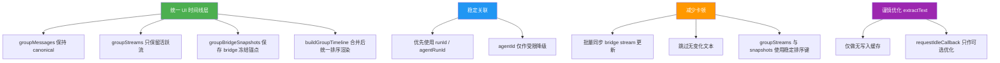

# CLI Agent 终端渲染问题修复方案（修订版）

> 文档版本：v2.0  
> 日期：2026-03-26  
> 状态：建议实施（修订版）

## 一、结论摘要

当前问题的诊断方向基本正确，但原 v1 方案里有几处实现边界不够稳妥，不能直接照搬到代码中。

本修订版的核心结论如下：

- **保留目标，不保留原实现**：仍然要解决“CLI 终端不像气泡那样跟随时间线”“多 Agent 并发卡顿/错位”“新消息不在底部”这三个问题，但**不再采用把 frozen bridge stream 直接写入 `groupMessages`** 的方式。
- **`groupMessages` 继续保持 canonical**：它仍然只承载服务端历史消息与正式消息，不混入前端临时 UI 占位条目。
- **新增独立的 UI 时间线层**：通过 `groupBridgeSnapshots`（或等价的独立 UI runtime state）承接 bridge terminal 的 frozen 锚点，再与 `groupMessages`、`groupStreams` 合并成一个统一时间线进行渲染。
- **终端实例必须保持唯一**：同一个 `(groupId, agentId)` 在任意时刻只允许存在一个 `<bridge-terminal>` 实例，避免 registry 冲突、恢复异常和位置抖动。
- **关联关系以 `runId / agentRunId` 为主**：不再默认按 `agentId` 粗粒度替换 frozen 项；`agentId` 只能作为受限降级策略。
- **性能优化以“减少无效更新”为主**：优先做批量 sync、跳过无变化更新、稳定排序；`extractText()` 的“真增量提取”不作为首要落地方案。

## 二、问题与现状确认

## 2.1 当前渲染结构的已确认事实

当前群聊消息区并不是一条真正统一的时间线，而是由多个物理区域拼接出来的：

```text
1. groupMessages
2. groupStreams
3. orphanBridgeTerminals
4. pendingAgents
```

在 `group-chat.ts`（view）里，渲染顺序本质上是：

```typescript
${repeat(groupMessages, ...)}
${Array.from(groupStreams.entries()).map(...)}
${renderOrphanBridgeTerminals(...)}
${pendingOnly.map(...)}
```

这意味着：

- `groupMessages` 中的内容一定排在最前面
- `groupStreams` 中的内容一定排在 `groupMessages` 后面
- orphan terminal 甚至还会独立于 stream 再渲染一层
- pending 指示器固定追加在最后

**这不是按单一时间线排序，而是“分区后再拼接”。**

## 2.2 当前状态边界的已确认事实

### 2.2.1 `groupMessages` 是服务端事实来源的前端镜像

`groupMessages` 目前承担的是**正式消息**语义：

- `loadGroupHistory()` 通过 `group.history` 把服务端历史直接加载到 `groupMessages`
- `handleGroupMessageEvent()` 把后端推送的正式消息追加到 `groupMessages`

也就是说，`groupMessages` 当前的设计语义非常明确：

- **它是 canonical message list**
- **不是前端临时 UI 容器**

### 2.2.2 `groupStreams` 是运行时流式态

`groupStreams` 当前用于存放进行中的流式内容，典型条目包含：

```typescript
{
  runId: string;
  text: string;
  startedAt: number;
  frozen?: boolean;
}
```

其特点是：

- 生命周期短
- 主要来源于 websocket / bridge terminal 的流式更新
- 理论上应服务于“活跃态展示”，而不是长期历史展示

### 2.2.3 `<bridge-terminal>` 组件具有全局唯一注册约束

`bridge-terminal.ts` 内部存在基于 `(groupId, agentId)` 的 registry：

```typescript
bridgeTerminalRegistry.set(`${groupId}:${agentId}`, this);
```

这意味着：

- 同一个 agent 的 terminal 在任何时刻**最好只挂载一次**
- 如果同一 agent 在两个位置同时渲染 `<bridge-terminal>`，会有明确风险：
  - registry 被后者覆盖
  - 前者 `disconnectedCallback()` 时可能把 registry 删除
  - replay、状态恢复、`extractVisibleText()`、折叠/展开行为都会不稳定

因此，**任何修复方案都必须遵守“单 terminal 实例”这一约束。**

## 2.3 三个问题与真实根因的对应关系

### 2.3.1 问题 1：终端看起来固定在底部

更准确地说，不是所有 bridge terminal 都固定在底部，而是：

- **活跃 bridge stream** 已经尽量 inline 渲染
- **frozen bridge stream** 长期留在 `groupStreams` 区域
- **orphan terminal** 可能独立渲染在流区域之后

因此，用户感知到的“终端固定在底部”，本质上是：

- bridge 内容在活跃态还能跟着 stream 走
- 一旦进入 frozen / orphan / refresh recovery 场景，就会脱离正常消息时间线
- 视觉上像是被“钉”在消息区下方

### 2.3.2 问题 2：多 Agent 并发时卡顿、错位、偶发卡住

已确认的主要原因有三类：

- **高频 Map 重建**：bridge terminal 周期性提取文本并驱动 `groupStreams` 更新，多个 agent 并发时，Lit 需要反复重算整段 stream 区域。
- **`extractVisibleText()` 同步成本高**：xterm buffer 提取是同步过程，内容多时会抢占主线程。
- **渲染顺序不稳定**：`Map` 的迭代顺序与插入/删除/重建顺序耦合，多个 stream 交错时，视觉位置容易抖动。

此外，原文档将这类现象描述为“typewriter 竞争条件”，这个表述偏重。更准确的说法应为：

- **多 stream 并发时，typewriter / markdown flush 的渲染成本被高频重渲染放大**
- 问题核心是**更新放大与重排**，而不是严格意义上的共享状态竞争 bug

### 2.3.3 问题 3：新消息不在最下面，而出现在 CLI Agent 上面

这是“分区渲染模型”的直接后果：

- 新用户消息进入 `groupMessages`
- 旧的 CLI frozen stream 仍留在 `groupStreams`
- 页面按“先 messages 后 streams”的固定顺序展示

因此会出现：

```text
[历史消息]
[用户新消息]
[旧的 CLI frozen bubble]
[新的其他 Agent stream]
```

而用户期望的是按真实时间线呈现：

```text
[历史消息]
[旧的 CLI 回复]
[用户新消息]
[新的其他 Agent 回复]
```

## 三、修订后的设计原则

后续实现应严格遵循以下原则：

### 3.1 不污染 canonical state

`groupMessages` 继续只承载：

- 服务端历史消息
- websocket 正式消息
- 系统消息

**不写入任何 bridge 临时冻结条目。**

### 3.2 单 terminal 实例原则

同一 `(groupId, agentId)` 在任意时刻只允许存在一个 `<bridge-terminal>` 实例。

含义是：

- active bridge stream 显示 terminal 时，旧 snapshot 不能同时再挂 terminal
- 同一 agent 开启新 run 时，terminal 应转移到新的 active 锚点，旧条目只保留文本，不再持有 terminal

### 3.3 关联粒度以 run 为单位

bridge 输出的生命周期必须优先绑定：

- `stream.runId`
- `message.agentRunId`

而不是只按 `agentId` 判断“哪一条该被替换”。

### 3.4 优先减少无效 UI 更新，而不是一味降频

性能优化的第一优先级应是：

- 跳过无变化更新
- 合并同批次 agent 更新
- 稳定排序
- 降低重复 markdown / directive flush

而不是简单把提取频率大幅降低，否则会伤害实时感。

### 3.5 恢复路径要与主路径一致

刷新恢复、断线恢复、completed terminal 回填都应该复用同一套“snapshot → 时间线渲染”逻辑，而不是单独再开一条 orphan 主路径。

## 四、推荐方案总览



## 五、详细方案

## 5.1 新增独立的 bridge snapshot 状态层

### 5.1.1 新增状态类型

推荐在 `controllers/group-chat.ts` 中新增一组纯前端 UI 态，而不是扩展 `GroupChatMessage`：

```typescript
export type GroupBridgeSnapshot = {
  id: string;
  groupId: string;
  agentId: string;
  runId: string;
  text: string;
  startedAt: number;
  timelineOrder: number;
  terminalVisible: boolean;
  terminalStatus: BridgeTerminalStatus;
  source: "live-freeze" | "refresh-recovery";
};
```

推荐在 `GroupChatState` 中新增：

```typescript
groupBridgeSnapshots: Map<string, GroupBridgeSnapshot>;
```

其中 key 推荐为：

```typescript
const snapshotKey = `${agentId}:${runId}`;
```

### 5.1.2 为什么必须独立于 `groupMessages`

采用独立 snapshot 层有以下好处：

- **不破坏 `groupMessages` 的 canonical 语义**
- **不影响 `loadGroupHistory()` / `handleGroupMessageEvent()` 这类正式消息路径**
- **不污染已有测试假设**
- **不需要在导出、持久化、消息去重里额外过滤临时消息**
- **恢复路径和活跃态可以复用同一套 UI 锚点机制**

### 5.1.3 `timelineOrder` 的作用

仅按时间戳排序还不够稳定，尤其在毫秒级相近或同值时。

因此建议为 runtime 条目增加单调递增的 `timelineOrder`：

- stream 创建时分配一次
- snapshot 创建时继承或重新分配一次
- 渲染排序时作为第二关键字

这样可以避免：

- 同毫秒条目顺序抖动
- Map 重建后相对顺序漂移
- 相邻 agent 位置频繁交换

## 5.2 bridge 生命周期改为“active stream → frozen snapshot”

## 5.2.1 活跃态：bridge 仍然走 `groupStreams`

在 agent 正在工作时：

- `groupStreams` 中保留 active bridge stream
- `<bridge-terminal>` 仍 inline 挂在 active stream 位置
- `groupBridgeSnapshots` 暂不参与该 run 的主展示

也就是说，**活跃态无需彻底推翻当前方案**，问题主要出在完成态与恢复态。

## 5.2.2 完成态：删除 active stream，写入 snapshot

当 `clearBridgeTerminalStream()` 被调用时，不再把 stream 留在 `groupStreams` 中标记为 `frozen: true`，而是改为：

1. 从 `streamBuffers` 中清理该 run 的缓冲
2. 从 `groupStreams` 中拿到当前 active bridge stream 内容
3. 将该 active stream 从 `groupStreams` 删除
4. 用同一个 `runId` 创建或更新 `groupBridgeSnapshots`
5. snapshot 的 `terminalVisible` 初始设为 `true`
6. 清理 `activeBridgeStreamRuns` 映射

推荐伪代码：

```typescript
export function clearBridgeTerminalStream(host: GroupChatState, agentId: string): void {
  const runId = activeBridgeStreamRuns.get(agentId);
  if (!runId) {
    return;
  }

  cleanupBridgeStreamBuffers(agentId, runId);

  const nextStreams = new Map(host.groupStreams);
  const current = nextStreams.get(agentId);
  if (!current || current.runId !== runId) {
    nextStreams.delete(agentId);
    host.groupStreams = nextStreams;
    activeBridgeStreamRuns.delete(agentId);
    return;
  }

  nextStreams.delete(agentId);
  host.groupStreams = nextStreams;

  const text = current.text?.trim() ?? "";
  if (text) {
    const key = `${agentId}:${runId}`;
    const nextSnapshots = new Map(host.groupBridgeSnapshots);
    nextSnapshots.set(key, {
      id: `bridge-snapshot:${key}`,
      groupId: host.activeGroupId!,
      agentId,
      runId,
      text: current.text,
      startedAt: current.startedAt,
      timelineOrder: current.timelineOrder,
      terminalVisible: true,
      terminalStatus: host.bridgeTerminalStatuses.get(agentId) ?? "completed",
      source: "live-freeze",
    });
    host.groupBridgeSnapshots = nextSnapshots;
  }

  activeBridgeStreamRuns.delete(agentId);
  flushPendingBridgeSyncIfNeeded(host);
}
```

### 5.2.3 新 working 周期：旧 snapshot 保留文本，但让出 terminal

当同一个 agent 又进入新的 `working` 周期时：

- **不要删除旧 snapshot 的文本内容**，否则会损失用户刚刚看到的历史输出
- 但必须把旧 snapshot 的 `terminalVisible` 置为 `false`
- 新的 active bridge stream 才能获得 terminal 的唯一挂载权

推荐规则：

```typescript
if (mappedStatus === "working") {
  // 1. 清理 groupStreams 中该 agent 的旧 frozen 遗留（如果还有）
  // 2. 将该 agent 所有 unresolved snapshots 的 terminalVisible 置为 false
  // 3. 新 run 创建 active stream 后，由 active stream 锚点展示 terminal
}
```

这样做有两个直接收益：

- 历史文本仍保留在时间线中
- 同一 agent 不会同时出现两个 terminal 实例

### 5.2.4 正式消息到达：删除匹配 snapshot，而不是替换 `groupMessages`

正式消息到达时，推荐做法是：

1. 按现有逻辑将正式消息追加到 `groupMessages`
2. 如果 `payload.agentRunId` 存在，则按 `${agentId}:${payload.agentRunId}` 删除匹配 snapshot
3. 不去改写 `groupMessages` 中已有条目，也不把 snapshot 替换成 message

推荐伪代码：

```typescript
export function handleGroupMessageEvent(host: GroupChatState, payload: GroupChatMessage): void {
  if (payload.groupId === host.activeGroupId) {
    if (!host.groupMessages.some((m) => m.id === payload.id)) {
      host.groupMessages = [...host.groupMessages, payload];
    }

    if (payload.sender.type === "agent" && "agentId" in payload.sender && payload.agentRunId) {
      const key = `${payload.sender.agentId}:${payload.agentRunId}`;
      if (host.groupBridgeSnapshots.has(key)) {
        const next = new Map(host.groupBridgeSnapshots);
        next.delete(key);
        host.groupBridgeSnapshots = next;
      }
    }
  }

  // ... 其余逻辑保持不变 ...
}
```

### 5.2.5 `agentId` 降级策略只能受限使用

如果后端暂时没有稳定提供 `agentRunId`，也**不建议默认按 `agentId` 替换 snapshot**。

较稳妥的降级规则应是：

- 只有当该 agent **恰好只有 1 条 unresolved snapshot**
- 且该 agent **当前没有 active stream**
- 且消息时间与 snapshot 时间足够接近

才允许按 `agentId` 做一次受限清理。

否则宁可暂时保留 snapshot，也不要误删错误 run 的历史锚点。

## 5.3 刷新恢复路径统一走 snapshot

当前页面刷新后，已完成 terminal 的恢复容易走“orphan terminal”路径。

修订后建议：

- 若 terminal 状态为 `completed / error / disconnected`
- 且当前没有对应 active bridge stream
- 且提取文本不为空
- 且还没有同一 `runId` 的 snapshot

则直接回填一条 snapshot，而不是优先制造 orphan stream / orphan terminal。

推荐伪代码：

```typescript
if (isCompletedLikeStatus(terminalStatus) && text.trim()) {
  const key = `${agentId}:${runId}`;
  const hasActive = host.groupStreams.get(agentId)?.runId === runId;
  const hasSnapshot = host.groupBridgeSnapshots.has(key);

  if (!hasActive && !hasSnapshot) {
    upsertBridgeSnapshot(host, {
      agentId,
      runId,
      text,
      startedAt: recoveredStartedAt,
      terminalVisible: true,
      terminalStatus: terminalStatus,
      source: "refresh-recovery",
    });
  }
}
```

这样，活跃态、完成态、恢复态都会汇总到同一类 UI 锚点中。

## 5.4 View 层改为构造统一时间线，而不是分区拼接

### 5.4.1 新增 `GroupTimelineItem`

推荐在 `views/group-chat.ts` 中引入一个纯渲染模型：

```typescript
type GroupTimelineItem =
  | {
      kind: "message";
      id: string;
      sortAt: number;
      order: number;
      message: GroupChatMessage;
    }
  | {
      kind: "stream";
      id: string;
      sortAt: number;
      order: number;
      agentId: string;
      stream: GroupStreamEntry;
    }
  | {
      kind: "bridge-snapshot";
      id: string;
      sortAt: number;
      order: number;
      snapshot: GroupBridgeSnapshot;
    };
```

其中：

- `message.sortAt = msg.timestamp`
- `stream.sortAt = stream.startedAt`
- `bridge-snapshot.sortAt = snapshot.startedAt`
- `order` 为稳定次序键，避免同毫秒抖动

### 5.4.2 构造时间线而不是直接分段渲染

推荐增加：

```typescript
function buildGroupTimeline(...) {
  // 1. 组装 messages
  // 2. 组装 active streams（不包含 frozen）
  // 3. 组装 bridge snapshots
  // 4. 按 compareTimelineItems 排序
  // 5. 返回统一列表
}
```

排序函数建议为：

```typescript
function compareTimelineItems(a: GroupTimelineItem, b: GroupTimelineItem): number {
  if (a.sortAt !== b.sortAt) {
    return a.sortAt - b.sortAt;
  }
  if (a.order !== b.order) {
    return a.order - b.order;
  }
  const rank = {
    message: 0,
    "bridge-snapshot": 1,
    stream: 2,
  } as const;
  return rank[a.kind] - rank[b.kind];
}
```

### 5.4.3 渲染时按 item 类型分发

```typescript
${repeat(timelineItems, (item) => item.id, (item) => {
  switch (item.kind) {
    case "message":
      return renderGroupMessage(item.message, ...);
    case "stream":
      return renderTimelineStream(item.agentId, item.stream, ...);
    case "bridge-snapshot":
      return renderBridgeSnapshot(item.snapshot, ...);
  }
})}
```

### 5.4.4 terminal 的挂载规则

渲染时必须确保：

- active bridge stream：可以渲染 terminal
- frozen snapshot：只有 `terminalVisible === true` 时才渲染 terminal
- orphan fallback：仅在**没有 active stream 锚点、没有 terminalVisible snapshot 锚点**时兜底使用

也就是说，`renderOrphanBridgeTerminals()` 不再是主路径，只保留为极少数异常恢复场景的 fallback。

## 5.5 `groupStreams` 的稳定排序与最小职责化

### 5.5.1 `groupStreams` 不再承载 frozen bridge 条目

修订后应明确：

- `groupStreams` 只保存 active stream
- bridge 完成后从 `groupStreams` 删除
- frozen 展示交给 `groupBridgeSnapshots`

这样 `groupStreams` 的职责会更清晰：

- 生命周期短
- 只负责活跃态
- 不再长期阻塞在消息区下方

### 5.5.2 即使在 stream 区域内部，也要稳定排序

即使已经引入 unified timeline，stream 本身仍应具备稳定顺序键，避免：

- active streams 被删后重建，顺序漂移
- 多 agent 同时更新时，Map 插入顺序把视觉位置带偏

因此，stream entry 推荐扩展为：

```typescript
{
  runId: string;
  text: string;
  startedAt: number;
  timelineOrder: number;
}
```

## 5.6 性能优化方案：优先减少无效更新

## 5.6.1 改造 `syncGroupStreams` 为批量合并，而不是全量频繁替换

当前主要问题不是“更新太慢”，而是“高频且很多是无效更新”。

推荐把现有全局单 timer 改为：

- `pendingSyncAgents: Set<string>`
- `batchSyncTimer: number | null`
- `batchSyncGroupStreams()`

推荐逻辑：

1. 每次 bridge terminal stream update 到达时，只把该 `agentId` 放入 `pendingSyncAgents`
2. 若当前已有 batch timer，则等待合并
3. timer 触发时，只同步本批次涉及的 agent
4. 若文本没变化，则不改 `host.groupStreams`
5. 只有真正变化时才触发一次响应式更新

推荐伪代码：

```typescript
const pendingSyncAgents = new Set<string>();
let batchSyncTimer: number | null = null;

function scheduleBatchSync(host: GroupChatState, agentId: string): void {
  pendingSyncAgents.add(agentId);
  if (batchSyncTimer !== null) {
    return;
  }
  batchSyncTimer = window.setTimeout(() => {
    batchSyncTimer = null;
    batchSyncGroupStreams(host);
  }, 60);
}

function batchSyncGroupStreams(host: GroupChatState): void {
  const agents = new Set(pendingSyncAgents);
  pendingSyncAgents.clear();

  const next = new Map(host.groupStreams);
  let changed = false;

  for (const [key, text] of streamBuffers) {
    const agentId = extractAgentId(key);
    const runId = extractRunId(key);
    if (!agents.has(agentId)) {
      continue;
    }

    const existing = next.get(agentId);
    if (existing?.runId === runId && existing.text === text) {
      continue;
    }

    next.set(agentId, {
      runId,
      text,
      startedAt: existing?.runId === runId ? existing.startedAt : Date.now(),
      timelineOrder: existing?.runId === runId ? existing.timelineOrder : allocateTimelineOrder(),
    });
    changed = true;
  }

  if (changed) {
    host.groupStreams = next;
  }
}
```

### 5.6.2 提取频率不要激进降级

原 v1 方案建议把 `STREAM_EXTRACT_INTERVAL` 从 `200ms` 提高到 `350ms`，并设置“变化小于 5 个字符就不发送”的阈值。

本修订版**不建议默认采用**这两条：

- `350ms` 容易让 bridge 镜像气泡显得迟钝
- “小于 5 个字符不发”会让进度条、spinner、短状态更新看起来像卡住了

建议顺序是：

1. **先保留 `200ms`**
2. 做完批量 sync + 跳过无变化后再测
3. 如果压力仍明显，再谨慎评估是否调到 `250ms`
4. 不引入“最小字符变化阈值”规则

### 5.6.3 `typewriter` 问题以降重排为主，不单独作为主攻点

bridge stream 当前已经使用 line 模式的 typewriter。现阶段更有效的优化是：

- 减少外层 re-render 次数
- 减少对未变化 stream 的重复 `update()` 调用
- 避免无意义的 markdown flush

如果 Phase 1/2 做完后仍有热点，再考虑：

- bridge stream bubble 在 working 态下关闭 typewriter
- 或改成更轻量的直接替换策略

但这应作为**后置优化选项**，不是当前主方案。

## 5.7 `extractVisibleText()` 的优化边界

### 5.7.1 可以做：无写入缓存

当前 `extractVisibleText()` 最终还是遍历 terminal buffer。真正意义上的“按脏区增量提取”在现有 xterm 封装下并不容易实现。

因此可落地的优化应是轻量缓存：

- terminal 有新写入时，标记 `_extractDirty = true`
- 下次提取时重新计算全文并更新缓存
- 如果期间没有新的写入，则复用 `_extractCache`

示意：

```typescript
private _extractCache: string | null = null;
private _extractDirty = true;

private _markExtractDirty(): void {
  this._extractDirty = true;
}

extractVisibleText(): string {
  if (!this._extractDirty && this._extractCache !== null) {
    return this._extractCache;
  }

  let text = "";
  if (this._terminal) {
    text = this._terminal.extractText();
  } else if (this._plainTextTerminal) {
    text = this._plainTextTerminal.extractText();
  }

  if (this.tailTrimMarker && text) {
    text = trimTailPrompt(text, this.tailTrimMarker);
  }

  this._extractCache = text;
  this._extractDirty = false;
  return text;
}
```

### 5.7.2 不把“真增量提取”作为本次主目标

本次修复不建议承诺以下能力：

- 只扫描 xterm 脏区
- 只重建 buffer 的局部行段
- 用 worker 完整迁移 terminal 文本提取

这些方向并非不可做，但改动范围和验证成本都明显超出当前问题的最小可行修复范围。

### 5.7.3 `requestIdleCallback` 只作为可选实验项

`requestIdleCallback` 可以作为附加优化尝试，但不建议设为默认主路径，因为：

- 主线程忙的时候，它可能更晚执行
- 反而会放大“bridge 镜像更新不及时”的体感

因此建议：

- 默认仍使用 `setTimeout`
- 若后续压测发现某些浏览器收益明显，可在 feature flag 下试验 `requestIdleCallback`

## 六、明确不采用的做法

以下做法在修订版中**明确不采用**：

### 6.1 不把 frozen bridge 项直接写入 `groupMessages`

原因：

- 污染 canonical state
- 影响历史、测试和去重语义
- 导出与持久化需要额外过滤
- 正式消息和临时消息混在一起，不利于后续维护

### 6.2 不默认按 `agentId` 替换临时项

原因：

- 同一 agent 可能存在多个 run
- refresh / replay / 延迟消息会让按 agentId 替换变得不可靠
- 极易误删错误的 bridge 锚点

### 6.3 不以“大幅降频”为主要性能方案

原因：

- 会损伤终端镜像的实时感
- 小变化场景最容易被误判为“卡住”
- 用户当前反馈本来就包含“会莫名卡主”

## 七、实施计划

## 7.1 阶段划分

| 阶段    | 内容                                                              | 涉及文件                                                                                                             | 优先级 |
| ------- | ----------------------------------------------------------------- | -------------------------------------------------------------------------------------------------------------------- | ------ |
| Phase 1 | 新增 `groupBridgeSnapshots`、梳理 bridge 生命周期、统一时间线渲染 | `ui/src/ui/controllers/group-chat.ts`, `ui/src/ui/views/group-chat.ts`                                               | P0     |
| Phase 2 | 批量 sync、跳过无变化更新、稳定排序键                             | `ui/src/ui/controllers/group-chat.ts`                                                                                | P0     |
| Phase 3 | 轻量 `extractVisibleText()` 缓存、可选性能试验                    | `ui/src/ui/components/bridge-terminal.ts`                                                                            | P1     |
| Phase 4 | 如有必要，再评估 typewriter 简化或更深层优化                      | `ui/src/ui/views/group-chat.ts`, `ui/src/ui/chat/typewriter-directive.ts`, `ui/src/ui/components/bridge-terminal.ts` | P2     |

## 7.2 Phase 1 详细变更清单

### 7.2.1 `ui/src/ui/controllers/group-chat.ts`

| 函数 / 状态                        | 变更类型 | 说明                                                             |
| ---------------------------------- | -------- | ---------------------------------------------------------------- |
| `GroupChatState`                   | 修改     | 新增 `groupBridgeSnapshots`                                      |
| runtime stream entry               | 修改     | 新增 `timelineOrder`                                             |
| `clearBridgeTerminalStream`        | 重写     | bridge 完成后删除 active stream，转为 snapshot                   |
| `handleGroupMessageEvent`          | 修改     | 正式消息追加到 `groupMessages` 后，按 `agentRunId` 清理 snapshot |
| `handleGroupTerminalStatusEvent`   | 修改     | 新 working 周期时让旧 snapshot 让出 terminal，但保留文本         |
| `handleBridgeTerminalStreamUpdate` | 修改     | completed / recovery 路径优先回填 snapshot                       |

### 7.2.2 `ui/src/ui/views/group-chat.ts`

| 函数 / 结构                   | 变更类型 | 说明                                              |
| ----------------------------- | -------- | ------------------------------------------------- |
| `GroupChatViewProps`          | 修改     | 透传 `groupBridgeSnapshots`                       |
| `buildGroupTimeline`          | 新增     | 合并 messages / active streams / bridge snapshots |
| `compareTimelineItems`        | 新增     | 提供稳定排序                                      |
| `renderBridgeSnapshot`        | 新增     | 渲染 frozen bridge 文本与可选 terminal            |
| 主消息区渲染                  | 重写     | 从“分区拼接”改为“统一 timeline repeat”            |
| `renderOrphanBridgeTerminals` | 收缩职责 | 仅保留极少数兜底场景                              |

## 7.3 Phase 2 详细变更清单

### 7.3.1 `ui/src/ui/controllers/group-chat.ts`

| 变更                                   | 说明                                |
| -------------------------------------- | ----------------------------------- |
| `pendingSyncAgents` + `batchSyncTimer` | 代替单一全局 `streamSyncTimer`      |
| `scheduleBatchSync`                    | 合并同批次 agent 更新               |
| `batchSyncGroupStreams`                | 只同步变更 agent，且跳过无变化文本  |
| `allocateTimelineOrder`                | 为 stream / snapshot 分配稳定次序键 |

## 7.4 Phase 3 详细变更清单

### 7.4.1 `ui/src/ui/components/bridge-terminal.ts`

| 变更                              | 说明                        |
| --------------------------------- | --------------------------- |
| `_extractCache` / `_extractDirty` | 无写入缓存                  |
| 写入路径统一 `markDirty`          | 有新 PTY 数据时标记缓存失效 |
| `extractVisibleText()`            | 仅在 dirty 时重新全文提取   |
| `requestIdleCallback`             | 仅作为实验项，不默认启用    |

## 八、风险评估

| 风险                                                | 影响 | 缓解措施                                                                                 |
| --------------------------------------------------- | ---- | ---------------------------------------------------------------------------------------- |
| 后端消息缺少稳定的 `agentRunId`                     | 中   | 前端优先支持 `agentRunId`；缺失时只做受限 `agentId` 降级，不做默认替换                   |
| 同一 agent 新旧 run 紧邻发生，terminal 锚点切换出错 | 高   | 严格执行“旧 snapshot 保留文本但 `terminalVisible=false`，新 active stream 独占 terminal” |
| unified timeline 排序规则不当，导致已有消息顺序回归 | 中   | 使用 `sortAt + order + kind rank` 三段式稳定比较器，并补充回归测试                       |
| 刷新恢复仍落入 orphan fallback                      | 中   | 将 completed/recovery 优先回填 snapshot，orphan 仅保底                                   |
| `extractVisibleText()` 仍有主线程开销               | 中   | 先通过批量 sync 与跳过无变化更新降低调用次数，再评估缓存收益                             |

## 九、测试要点

## 9.1 功能测试

1. **单 CLI Agent 完成后的位置正确**
   - CLI active stream 完成后，应从 active stream 区移除
   - 对应 snapshot 应按 `startedAt` 落在正确时间位置
   - terminal 应跟随 snapshot，而不是单独固定在底部

2. **CLI 完成后用户继续对其他 Agent 发言**
   - 用户新消息应排在 CLI snapshot 下方
   - 其他 Agent 的新回复应继续出现在最下方
   - 不应再出现“新消息压在旧 CLI 上面”的视觉错乱

3. **同一 CLI Agent 开启新 run**
   - 旧 snapshot 文本仍保留
   - 旧 snapshot 的 terminal 消失
   - 新 active run 获得 terminal 的唯一挂载权

4. **正式消息到达后清理 snapshot**
   - 若消息包含 `agentRunId`，应准确清理匹配 snapshot
   - 不应误删同 agent 的其他 snapshot

5. **刷新恢复**
   - 已完成 terminal 刷新后应恢复为 snapshot 锚点
   - 不应优先走 orphan terminal 主路径

## 9.2 并发测试

1. **两个 CLI Agent 同时工作 60 秒**
   - 气泡文本持续更新
   - 位置顺序稳定
   - 不出现明显卡死或乱序交换

2. **两个 CLI Agent 先后完成，再插入用户消息和普通 Agent 消息**
   - 时间线顺序应稳定
   - 不受 `Map` 插入顺序影响

3. **一个 CLI Agent 高频短输出，一个普通 Agent 正在 stream**
   - 普通 Agent stream 不应因为 CLI 高频更新而频繁重排

## 9.3 性能测试

1. **多 terminal 并发场景下的主线程耗时**
   - 观察 `extractVisibleText()` 的调用频率与总耗时
   - 验证 Phase 2 后 `groupStreams` 的无效更新是否显著下降

2. **长 terminal 内容场景**
   - xterm scrollback 达到较大规模时，页面仍可交互
   - bridge 镜像更新保持可接受的实时性

3. **回归检查**
   - 非 bridge Agent 的普通消息与 stream 行为不应被影响
   - 导出、历史加载、系统消息、pending 指示器行为保持原样

## 十、最终建议

建议按以下顺序推进：

1. **先做结构性修复**：引入 `groupBridgeSnapshots`，把 bridge 完成态和恢复态统一纳入时间线渲染。
2. **再做更新收敛**：减少 `groupStreams` 的无效同步与重排。
3. **最后做轻量性能优化**：对 `extractVisibleText()` 增加 dirty cache，而不是一开始就尝试复杂的真增量提取。

如果严格按本修订版实施，三个问题会分别得到如下修复：

- **问题 1（终端位置像固定在底部）**：通过 snapshot 锚点进入统一时间线解决。
- **问题 2（多 Agent 卡顿/错位）**：通过批量 sync、稳定排序、减少无效更新解决。
- **问题 3（新消息不在底部）**：通过取消“历史区 / frozen 区”分裂、改为统一 timeline 排序解决。

这也是当前代码结构下，**改动风险、实现复杂度、长期可维护性三者最平衡**的一版方案。
