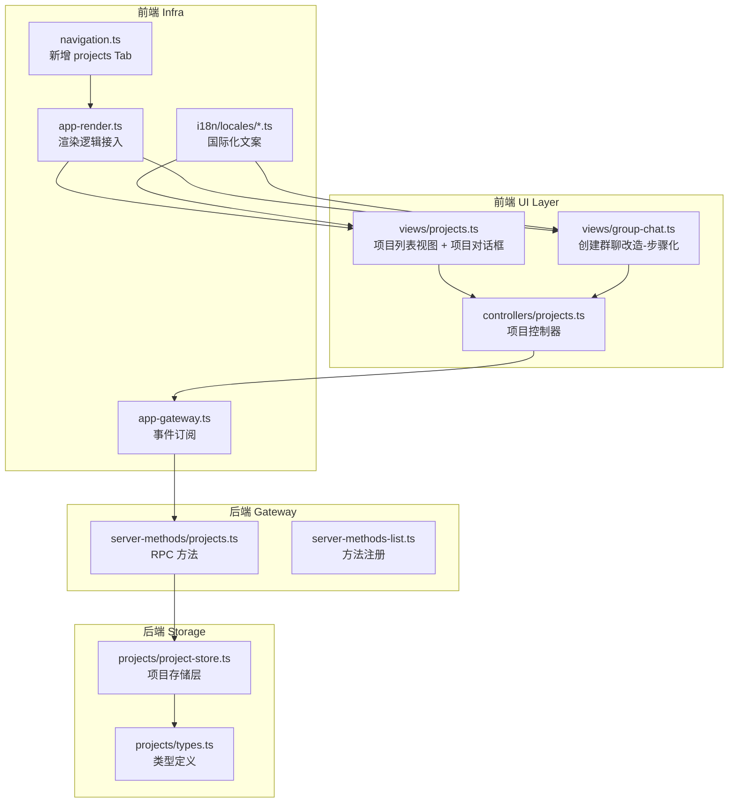

# 项目管理功能 — 实现方案

## 架构概览

根据设计稿和现有代码结构分析，项目管理功能需要跨越**后端存储层**、**Gateway RPC 方法层**、**前端控制器层**、**前端视图层**和**国际化层**五个层面进行实现。整体架构遵循现有的 group-chat 模块模式。



---

## Phase 1: 基础功能（项目 CRUD）

### 1. 后端 — 数据层

#### 📄 `src/projects/types.ts` (新建)

**职责**：项目的类型定义

```typescript
// 数据模型定义
export type Project = {
  id: string; // UUID
  name: string; // 项目名称（唯一，不可更改）
  directory: string; // 项目目录（绝对路径）
  documents: string[]; // 项目文档路径数组
  description?: string; // 项目描述
  createdAt: number; // 创建时间戳
  updatedAt: number; // 更新时间戳
};

// 索引条目（轻量）
export type ProjectIndexEntry = {
  id: string;
  name: string;
  updatedAt: number;
};
```

> **设计说明**：完全复用 `group-store.ts` 的存储模式——index.json + 每个项目独立 meta.json

#### 📄 `src/projects/project-store.ts` (新建)

**职责**：项目的文件系统存储层（CRUD + 缓存 + 原子写入）

**参考模板**：`src/group-chat/group-store.ts`

**核心功能**：

- `resolveProjectsRoot()` → `~/.openclaw/projects/`
- `resolveProjectDir(projectId)` → 项目子目录
- `resolveProjectIndexPath()` → `index.json`
- `resolveProjectMetaPath(projectId)` → `meta.json`
- `loadProjectIndex()` — 读取索引（带缓存 + mtime 校验）
- `loadProjectMeta(projectId)` — 读取项目元数据
- `createProject(params)` — 创建项目（写 meta.json + 更新 index）
- `updateProject(projectId, mutator)` — 更新项目（原子写 + 缓存失效）
- `deleteProject(projectId)` — 删除项目（rm -rf + 更新 index）
- `findProjectByName(name)` — 按名称查找（唯一性校验用）
- 内存队列锁 `withProjectLock()` 防并发冲突
- 缓存 TTL + mtime 失效机制

#### 📄 `src/projects/index.ts` (新建)

**职责**：模块导出入口

---

### 2. 后端 — Gateway RPC 层

#### 📄 `src/gateway/server-methods/projects.ts` (新建)

**职责**：处理所有 `projects.*` 的 RPC 方法

**注册方法**：

| RPC 方法                 | 功能             | 参数                                                  |
| ------------------------ | ---------------- | ----------------------------------------------------- |
| `projects.list`          | 获取项目列表     | 无                                                    |
| `projects.info`          | 获取单个项目详情 | `{ projectId }`                                       |
| `projects.create`        | 创建项目         | `{ name, directory, documents?, description? }`       |
| `projects.update`        | 更新项目         | `{ projectId, directory?, documents?, description? }` |
| `projects.delete`        | 删除项目         | `{ projectId }`                                       |
| `projects.validatePaths` | 验证路径有效性   | `{ paths, type: "directory" \| "file" }`              |

**参考模板**：`src/gateway/server-methods/group.ts` 的方法注册模式

**核心逻辑**：

- 每个方法做参数校验 → 调用 `project-store` → 返回结果
- `projects.create` 需校验：名称唯一性、目录存在性
- `projects.delete` 需处理：关联群聊的 `projectId` 置空
- `projects.validatePaths` 用于前端创建/编辑对话框的实时路径验证

#### 📄 `src/gateway/server-methods-list.ts` (修改)

在 `BASE_METHODS` 数组中添加：

```typescript
// Project management methods
"projects.list",
"projects.info",
"projects.create",
"projects.update",
"projects.delete",
"projects.validatePaths",
```

---

### 3. 前端 — 控制器层

#### 📄 `ui/src/ui/controllers/projects.ts` (新建)

**职责**：项目管理的前端状态管理和 RPC 调用

**参考模板**：`ui/src/ui/controllers/group-chat.ts` 的控制器模式

**核心内容**：

```typescript
// 类型定义
export type Project = { id; name; directory; documents; description?; createdAt; updatedAt };
export type ProjectIndexEntry = { id; name; updatedAt };

// 对话框状态
export type ProjectCreateDialogState = {
  name: string;
  directory: string;
  documents: string;
  description: string;
  isBusy: boolean;
  error: string | null;
};
export type ProjectEditDialogState = ProjectCreateDialogState & { projectId: string };
export type ProjectDeleteDialogState = {
  projectId: string;
  projectName: string;
  linkedGroupCount: number;
  isBusy: boolean;
  error: string | null;
};

// 页面状态
export type ProjectsState = {
  projectsList: ProjectIndexEntry[];
  projectsLoading: boolean;
  activeProject: Project | null;
  projectCreateDialog: ProjectCreateDialogState | null;
  projectEditDialog: ProjectEditDialogState | null;
  projectDeleteDialog: ProjectDeleteDialogState | null;
  projectError: string | null;
};

// RPC 调用函数
export async function loadProjectsList(host): Promise<void>;
export async function loadProjectInfo(host, projectId): Promise<void>;
export async function createProject(host, params): Promise<void>;
export async function updateProject(host, projectId, params): Promise<void>;
export async function deleteProject(host, projectId): Promise<void>;
export async function validateProjectPaths(host, paths, type): Promise<ValidationResult[]>;

// 初始状态
export function getInitialProjectsState(): ProjectsState;
```

---

### 4. 前端 — 视图层

#### 📄 `ui/src/ui/views/projects.ts` (新建)

**职责**：项目管理页面的完整视图（列表 + 卡片 + 创建/编辑对话框 + 删除确认对话框）

**参考模板**：`ui/src/ui/views/group-chat.ts` 的视图组织方式

**核心组成**：

```typescript
// Props 定义
export type ProjectsViewProps = {
  // 状态
  projectsList: ProjectIndexEntry[];
  projectsLoading: boolean;
  activeProject: Project | null;
  // 对话框
  projectCreateDialog: ProjectCreateDialogState | null;
  projectEditDialog: ProjectEditDialogState | null;
  projectDeleteDialog: ProjectDeleteDialogState | null;
  projectError: string | null;
  // 群聊信息（用于显示关联群聊数量）
  groupIndex: GroupIndexEntry[];
  // 回调
  onLoadProjectInfo: (projectId: string) => void;
  onOpenCreateDialog: () => void;
  onCloseCreateDialog: () => void;
  onCreateProject: (params) => void;
  onOpenEditDialog: (project: Project) => void;
  onCloseEditDialog: () => void;
  onUpdateProject: (projectId, params) => void;
  onOpenDeleteDialog: (projectId, projectName) => void;
  onCloseDeleteDialog: () => void;
  onDeleteProject: (projectId) => void;
  onValidatePaths: (paths, type) => Promise<ValidationResult[]>;
};

// 渲染函数
export function renderProjectsView(props: ProjectsViewProps): TemplateResult;

// 内部函数
function renderProjectList(props): TemplateResult; // 项目卡片列表
function renderProjectCard(project, props): TemplateResult; // 单个项目卡片
function renderEmptyState(props): TemplateResult; // 空状态
function renderCreateDialog(props): TemplateResult; // 创建对话框
function renderEditDialog(props): TemplateResult; // 编辑对话框
function renderDeleteDialog(props): TemplateResult; // 删除确认对话框
```

**UI 要点**：

- 路径输入框支持路径自动补全（调用 `validatePaths` RPC）
- 文档列表区域显示验证状态（✅/❌）
- 项目名称实时唯一性验证

---

### 5. 前端 — 导航整合

#### 📄 `ui/src/ui/navigation.ts` (修改)

需要修改以下内容：

```typescript
// 1. TAB_GROUPS 中新增 projects
{ labelKey: "nav.group.control", tabs: ["overview", "projects", "channels", ...] }

// 2. Tab 类型新增
export type Tab = ... | "projects";

// 3. TAB_PATHS 新增
projects: "/projects",

// 4. iconForTab 新增
case "projects": return "folder";  // 或使用合适的图标
```

#### 📄 `ui/src/ui/app-render.ts` (修改)

在 `renderTabContent` 或等价逻辑中新增：

```typescript
case "projects":
  return renderProjectsView({
    projectsList: state.projectsList,
    projectsLoading: state.projectsLoading,
    // ... 传入所有 props 和回调
  });
```

#### 📄 `ui/src/ui/app-gateway.ts` (修改)

在连接成功后的初始化加载中添加：

```typescript
// 连接后加载项目列表
await loadProjectsList(state);
```

---

### 6. 国际化

#### 📄 `ui/src/ui/i18n/locales/en.ts` (修改)

添加设计稿中定义的所有英文 i18n key。

#### 📄 `ui/src/ui/i18n/locales/zh-CN.ts` (修改)

添加设计稿中定义的所有中文 i18n key。

#### 📄 `ui/src/ui/i18n/locales/zh-TW.ts` (修改)

添加繁体中文对应的 i18n key。

---

## Phase 2: 群聊集成

### 7. 创建群聊流程改造

#### 📄 `ui/src/ui/views/group-chat.ts` (修改)

**改造点**：将现有的单步创建对话框改为两步

```typescript
// 修改 GroupCreateDialogState，新增步骤和项目选择
export type GroupCreateDialogState = {
  step: 1 | 2; // 新增：步骤
  selectedProjectId: string | null; // 新增：选中的项目 ID
  selectedProject: Project | null; // 新增：选中的项目信息
  // ... 现有字段保持不变
  name: string;
  selectedAgents: string[];
  pendingRoles: Record<string, string>;
  messageMode: "unicast" | "broadcast";
  projectDirectory: string;
  projectDocs: string;
  isBusy: boolean;
  error: string | null;
};
```

**新增渲染函数**：

- `renderCreateGroupStep1(props)` — 项目选择步骤（搜索 + 列表 + 「不关联项目」选项）
- `renderCreateGroupStep2(props)` — 群聊信息步骤（现有表单，预填项目信息）

**新增回调**：

- `onSelectProject(projectId)` — 选择项目
- `onDeselectProject()` — 取消选择
- `onNextStep()` / `onPrevStep()` — 步骤切换

#### 📄 `ui/src/ui/controllers/group-chat.ts` (修改)

- 创建群聊时，如果选择了项目，将 `projectId` 写入 `GroupSessionEntry`
- 加载群聊信息时，解析关联的项目信息

#### 📄 `src/group-chat/types.ts` (修改)

```typescript
export type GroupSessionEntry = {
  // ... 现有字段
  projectId?: string; // 新增：关联的项目 ID
};
```

#### 📄 `src/group-chat/group-store.ts` (修改)

- `createGroup` 方法新增 `projectId` 参数支持
- 当指定了 `projectId` 时，自动从 project-store 读取 directory 和 docs

---

### 8. 项目详情页（关联群聊管理）

#### 📄 `ui/src/ui/views/projects.ts` (扩展)

新增项目详情/管理子视图：

```typescript
function renderProjectDetail(props): TemplateResult; // 项目详情视图
function renderLinkedGroupsList(props): TemplateResult; // 关联群聊列表
```

**功能**：

- 显示项目基本信息
- 列出关联的群聊（通过遍历 groupIndex 中 projectId 匹配）
- 支持从项目详情页直接「创建群聊」（自动关联当前项目）
- 支持「进入群聊」跳转

---

## Phase 3: 体验优化

### 9. 路径自动补全

#### 📄 `src/gateway/server-methods/projects.ts` (扩展)

新增 RPC 方法：

```typescript
"projects.autocompletePath";
// 参数: { basePath: string, prefix: string, type: "directory" | "file" }
// 返回: string[] (匹配的路径列表)
```

通过 `fs.readdir` + 过滤实现服务端路径补全。

### 10. 全局搜索集成

在 `ui/src/ui/views/overview.ts` 或全局搜索组件中，将项目纳入搜索范围。

---

## 文件变更总结

### 新增文件 (6 个)

| 文件路径                                 | 职责                                 |
| ---------------------------------------- | ------------------------------------ |
| `src/projects/types.ts`                  | 项目类型定义                         |
| `src/projects/project-store.ts`          | 项目存储层（CRUD + 缓存 + 原子写入） |
| `src/projects/index.ts`                  | 模块导出入口                         |
| `src/gateway/server-methods/projects.ts` | 项目 RPC 方法处理                    |
| `ui/src/ui/controllers/projects.ts`      | 前端项目控制器                       |
| `ui/src/ui/views/projects.ts`            | 项目管理视图                         |

### 修改文件 (10 个)

| 文件路径                             | 改动说明                                  |
| ------------------------------------ | ----------------------------------------- |
| `src/gateway/server-methods-list.ts` | 注册 `projects.*` RPC 方法                |
| `src/group-chat/types.ts`            | `GroupSessionEntry` 新增 `projectId` 字段 |
| `src/group-chat/group-store.ts`      | `createGroup` 支持 `projectId` 参数       |
| `ui/src/ui/navigation.ts`            | 新增 `projects` Tab 和路由                |
| `ui/src/ui/app-render.ts`            | 接入项目视图渲染 + 传递回调               |
| `ui/src/ui/app-gateway.ts`           | 连接后加载项目列表                        |
| `ui/src/ui/views/group-chat.ts`      | 创建群聊两步化改造                        |
| `ui/src/ui/i18n/locales/en.ts`       | 英文国际化文案                            |
| `ui/src/ui/i18n/locales/zh-CN.ts`    | 中文国际化文案                            |
| `ui/src/ui/i18n/locales/zh-TW.ts`    | 繁体中文国际化文案                        |

---

## 实现优先级

```mermaid
gantt
    title 项目管理功能实现计划
    dateFormat  X
    axisFormat %s

    section Phase 1 - 基础 CRUD
    后端类型定义 + 存储层           :a1, 0, 2
    Gateway RPC 方法              :a2, 2, 3
    前端控制器                    :a3, 3, 4
    前端视图 (列表+对话框)         :a4, 4, 7
    导航整合 + i18n               :a5, 7, 8

    section Phase 2 - 群聊集成
    创建群聊两步化改造             :b1, 8, 11
    项目详情页 (关联群聊)          :b2, 11, 13
    GroupSessionEntry 新增 projectId :b3, 8, 9

    section Phase 3 - 体验优化
    路径自动补全                   :c1, 13, 15
    全局搜索集成                   :c2, 15, 16
```



---

## 关键设计决策

1. **存储模式**：完全复用 `group-store` 的 JSON 文件存储模式（`~/.openclaw/projects/`），保持一致性
2. **项目与群聊关系**：一对多关系，通过 `GroupSessionEntry.projectId` 关联，项目删除时群聊变为独立群聊
3. **项目名称不可修改**：作为人类可读的唯一标识符，创建后锁定
4. **向后兼容**：`projectId` 为可选字段，不影响已有群聊的正常使用
5. **两步创建群聊**：第一步选择项目（可跳过），第二步填写群聊信息，项目选择会自动填充 directory 和 docs
